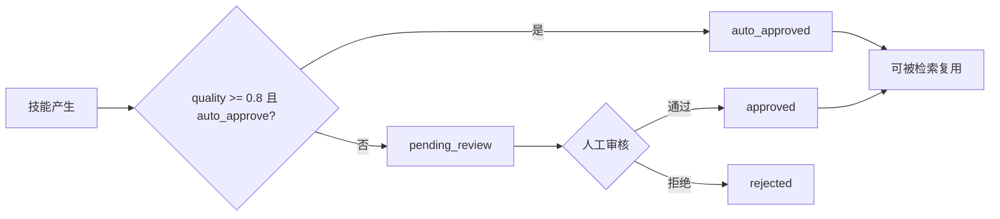

# Semibot: 进化系统 — 质量治理

**Priority:** High
**Status:** Not Started
**Type:** Feature
**Created:** 2026-02-17
**Last Updated:** 2026-02-17

## Overview

实现进化系统的质量控制与治理机制，包括人工审核工作流、自动审批逻辑、安全检查、质量退化自动处理（低成功率技能自动废弃）、监控指标、Webhook 事件。

## Description

进化系统产生的技能需要经过严格的质量把关才能被复用。本 PRD 覆盖从技能产生到废弃的全生命周期治理：人工审核流程确保技能质量、自动审批提升效率、安全检查防止危险操作、质量退化监控自动废弃低质量技能、Prometheus 指标和 Webhook 事件提供可观测性。

参考设计文档：`docs/design/EVOLUTION.md` 第 7、8、9 节。

## Features / Requirements

### 1. 人工审核工作流

- 默认所有进化技能状态为 `pending_review`，需人工审核
- 审核操作：`approve`��通过）或 `reject`（拒绝）
- 审核记录：`reviewed_by`、`reviewed_at`、`review_comment`
- 审核界面展示：技能定义、来源会话、质量评分、相似技能对比
- 只有 `pending_review` 状态的技能可被审核

### 2. 自动审批逻辑

- 条件：`quality_score >= 0.8` 且 Agent 配置 `evolution.auto_approve = true`
- 满足条件时状态直接设为 `auto_approved`，跳过人工审核
- `auto_approved` 的技能立即可被检索复用

### 3. 安全检查

- 危险操作白名单：技能步骤中涉及删除数据、发送邮件、外部 API 调用等操作需在白名单内
- 参数注入防护：所有技能参数必须经过 Zod Schema 验证，不能注入系统命令
- 进化频率限制：每小时最多 `max_evolve_per_hour` 次（默认 5），防止恶意触发
- 租户隔离：进化技能严格按 `org_id` 隔离

### 4. 质量退化自动处理

自动监控技能复用效果，退化时自动处理：

| 条件 | 动作 |
|------|------|
| `success_rate < 50%` 且 `use_count >= 5` | 自动标记为 `deprecated` |
| `use_count = 0` 且创建超过 30 天 | 标记为候选清理 |
| 连续 3 次复用失败 | 临时禁用，等待人工审核 |

- 定时任务（cron job）每日执行质量退化检查
- 退化操作记录到 `evolution_logs`
- 退化时触发 `evolution.skill_deprecated` Webhook 事件

### 5. 监控指标（Prometheus）

| 指标 | 类型 | 说明 |
|------|------|------|
| `evolution_triggered_total` | Counter | 进化触发总次数 |
| `evolution_success_total` | Counter | 进化成功次数 |
| `evolution_skill_quality` | Histogram | 技能质量分布 |
| `evolved_skill_reuse_total` | Counter | 进化技能被复用次数 |
| `evolved_skill_reuse_success_rate` | Gauge | 复用成功率 |
| `evolution_duration_seconds` | Histogram | 进化流程耗时 |
| `evolution_tokens_total` | Counter | 进化消耗的 Token |

### 6. Webhook 事件

| 事件 | 说明 |
|------|------|
| `evolution.triggered` | 进化流程触发 |
| `evolution.skill_created` | 新技能产生 |
| `evolution.skill_approved` | 技能审核通过 |
| `evolution.skill_rejected` | 技能审核拒绝 |
| `evolution.skill_deprecated` | 技能被废弃 |
| `evolution.skill_promoted` | 技能提升为正式技能 |

## Files to Create

- `apps/api/src/services/evolution-governance.service.ts` — 质量退化检查和自动处理
- `apps/api/src/jobs/evolution-cleanup.job.ts` — 定时清理任务
- `runtime/src/evolution/safety.py` — 安全检查模块
- `apps/api/src/metrics/evolution.metrics.ts` — Prometheus 指标定义
- `apps/api/src/events/evolution.events.ts` — Webhook 事件定义和触发

## Files to Modify

- `apps/api/src/services/evolved-skill.service.ts` — 集成审核工作流和安全检查
- `apps/api/src/jobs/index.ts` — 注册定时清理任务
- `apps/api/src/metrics/index.ts` — 注册进化指标
- `apps/api/src/events/index.ts` — 注册进化事件

## Testing Requirements

### Unit Tests

- 自动审批条件判断测试
- 安全检查白名单测试
- 质量退化条件判断测试（各种边界条件）
- 频率限制测试
- Webhook 事件触发测试

### Integration Tests

- 完整审核工作流端到端测试
- 质量退化定时任务执行测试
- 连续失败自动禁用测试

## Acceptance Criteria

- [ ] 人工审核工作流正常运作，状态流转正确
- [ ] 自动审批在满足条件时正确触发
- [ ] 安全检查覆盖所有危险操作类型
- [ ] 质量退化自动处理逻辑正确（低成功率废弃、长期未用清理、连续失败禁用）
- [ ] 定时清理任务可正常执行
- [ ] Prometheus 指标正确采集
- [ ] Webhook 事件在对应操作时正确触发
- [ ] 所有操作包含 `org_id` 租户隔离
