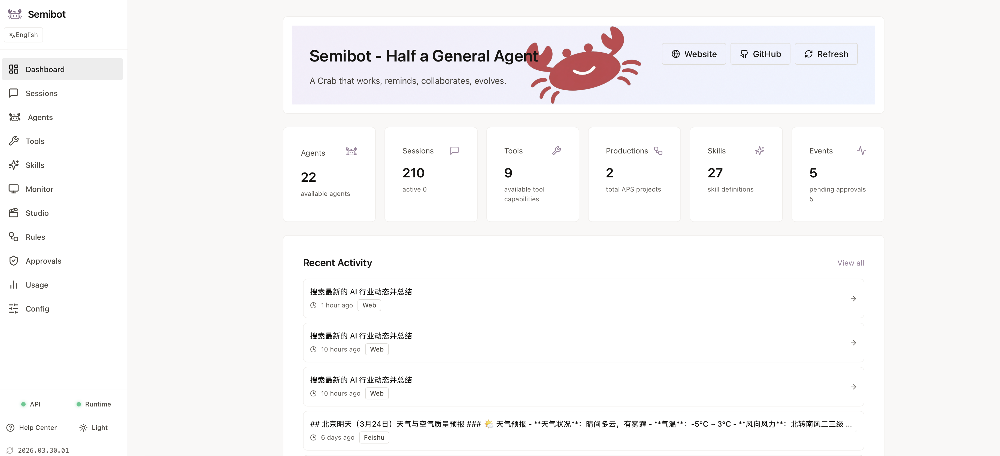

# Semibot

[中文](./README.zh-CN.md) | [English](./README.en.md) | [日本語](./README.ja.md)

[Website](https://semibot.ai) | [Help Center](https://semibot.ai/help) | [Install Guide](https://semibot.ai/help/install) | [CLI Reference](https://semibot.ai/help/cli)

Semibot is a local-first, installable AI assistant and agent workspace. It can research, write, handle files, execute local and browser tasks, and extend the same assistant into Telegram, Feishu, and other bot entry points.

## Product Screenshot



## Try These Flows

- Research a topic, summarize it, and keep the result in one local workspace
- Draft a reply or plan, then continue the task with files, commands, or browser steps
- Run the same assistant from the web UI first, then extend it to Telegram or Feishu
- Add approval checks before higher-risk actions in team or production-style workflows

## Why Semibot

- Local-first runtime instead of a hosted black box
- Installable product, not just a single chat page or demo script
- Web UI, CLI, API, and runtime in one stack
- Approval gates for higher-risk actions
- Multi-entry workflows across web and messaging channels

## What It Can Do

- Research and summarize information
- Draft replies, plans, and longer-form content
- Handle files, folders, and repetitive data work
- Execute local commands and browser-side tasks
- Run reminders, follow-ups, and longer task flows
- Extend the same assistant into Telegram, Feishu, and other channels

## Quick Start

```bash
curl -fsSL https://releases.semibot.ai/install.sh | bash
semibot init
semibot ui
```

Recommended platforms: macOS and Linux. On Windows, use WSL.

Start with three steps:

1. Install Semibot locally
2. Run `semibot init` to prepare the local environment
3. Run `semibot ui` to open the local entry point and continue setup

Default release endpoints:

- Install script: `https://releases.semibot.ai/install.sh`
- Update manifest: `https://releases.semibot.ai/stable/latest.json`
- Release base URL: `https://releases.semibot.ai/stable`

## Docs

- Website: `https://semibot.ai`
- Help center: `https://semibot.ai/help`
- Install guide: `https://semibot.ai/help/install`
- CLI reference: `https://semibot.ai/help/cli`
- Bot setup guide: `https://semibot.ai/help/bot-setup`

## Architecture

- `apps/web`: Next.js web UI
- `apps/api`: Node.js API
- `runtime`: Python runtime, CLI, built-in supervisor
- `packages/*`: shared config and types

This repository contains the Semibot core codebase used to build the installable product and local-first runtime.

## Product Highlights

- Simple work can stay fast, while multi-step work can follow a more structured path
- Local and browser execution stays close to the real working environment
- Useful workflows can be reused instead of rebuilt from zero every time
- One chat entry point can fan out into multiple working threads
- Stronger models can be reserved for deeper reasoning, with lighter models handling execution and cleanup

## Entry Points

- `Web UI`: handle chat, tasks, approvals, and status in one local interface
- `CLI`: useful for quick runs, scripts, and terminal-first workflows
- `Channels`: extend the same assistant into Telegram, Feishu, Discord, WhatsApp, and iMessage when needed

## Local Development

Prerequisites:

- Node.js `20+`
- `pnpm 9+`
- Python `3.11+`

Install dependencies:

```bash
pnpm install
python3 -m venv runtime/.venv
runtime/.venv/bin/pip install -r runtime/requirements.txt
```

Start the full development stack:

```bash
pnpm dev
```

Start services individually:

```bash
pnpm --dir apps/api dev
pnpm --dir apps/web dev
cd runtime && .venv/bin/python -m src.main serve start
```

Useful runtime commands:

```bash
cd runtime
python -m src.main init
python -m src.main up
python -m src.main status
python -m src.main ui --no-open
```

## Core Scenarios

- Individuals who want AI to help with real work, not just one-turn chat
- Teams that need a shared assistant with one setup and human checks on important steps
- Workflows that need tools, files, commands, and follow-through after the answer
- Setups that want the same assistant in the web UI, CLI, Telegram, Feishu, and other channels

## Roadmap Direction

- Better out-of-the-box task demos
- Stronger approval and recovery UX
- More installable connectors and runtime skills
- A clearer path from personal agent to team deployment

## Get Help

- Install help: `https://semibot.ai/help/install`
- CLI help: `https://semibot.ai/help/cli`
- Bot setup: `https://semibot.ai/help/bot-setup`
- Feishu guide: `https://semibot.ai/help/feishu`
- Telegram guide: `https://semibot.ai/help/telegram`
- Discord guide: `https://semibot.ai/help/discord`
- WhatsApp guide: `https://semibot.ai/help/whatsapp`
- iMessage guide: `https://semibot.ai/help/imessage`

## Contributing

External contributions are welcome. See:

- `CONTRIBUTING.md`
- `CLA.md`
- `LICENSE`
- `TRADEMARKS.md`

## Maintainers

Release build:

```bash
./scripts/build_release.sh
```

Common build flags:

```bash
SKIP_BUILD=1 ./scripts/build_release.sh
INCLUDE_NODE_MODULES=1 ./scripts/build_release.sh
INCLUDE_RUNTIME_VENV=1 ./scripts/build_release.sh
```

Common validation:

```bash
pnpm --dir apps/api type-check
python3 -m pytest runtime/tests/test_cli.py -q
python3 -m compileall runtime/src
```
