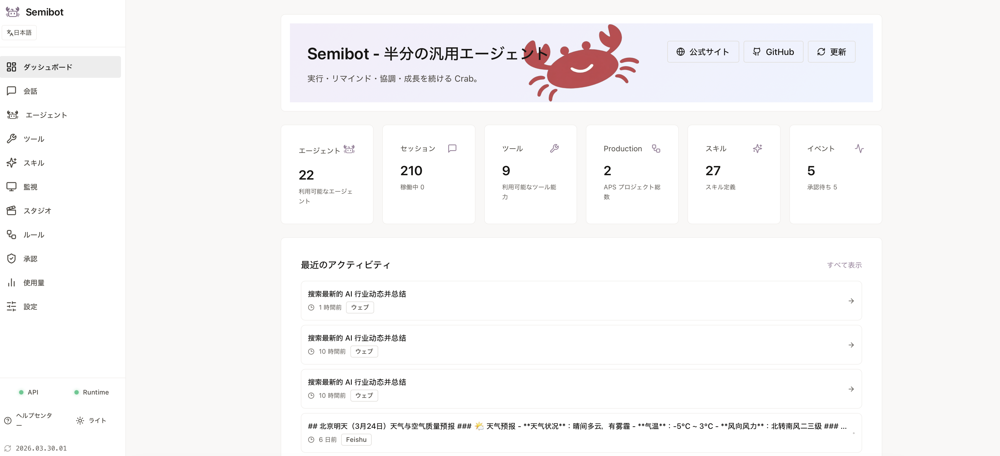

# Semibot

[中文](./README.zh-CN.md) | [English](./README.en.md) | [日本語](./README.ja.md)

[Website](https://semibot.ai) | [Help Center](https://semibot.ai/help) | [Install Guide](https://semibot.ai/help/install) | [CLI Reference](https://semibot.ai/help/cli)

Semibot は、ローカルファーストでインストール可能な AI アシスタント兼エージェントワークスペースです。調査、文章作成、ファイル処理、ローカル実行、ブラウザ操作をこなし、同じアシスタントを Telegram や Feishu などの Bot 入口にも広げられます。

## 製品スクリーンショット



## まず試せる流れ

- ひとつのテーマを調べ、要点をまとめ、結果をローカル workspace に残す
- 返信や計画を下書きしたあと、そのままファイル、コマンド、ブラウザ操作へ進む
- まず Web UI で同じアシスタントを動かし、その後 Telegram や Feishu に広げる
- チーム利用や本番寄りのワークフローで、高リスク操作に承認チェックを入れる

## Why Semibot

- ホスト型ブラックボックスではなく、ローカルファーストな実行環境
- 単なるチャット画面やデモスクリプトではなく、インストール可能な製品
- Web UI、CLI、API、runtime がひとつのスタックにまとまっている
- 高リスク操作には承認ゲートを入れられる
- Web とメッセージングの複数入口で同じアシスタントを使える

## What It Can Do

- 情報を調べて要点をまとめる
- 返信、計画、長めの文章を下書きする
- ファイル、フォルダ、反復的なデータ作業を処理する
- ローカルコマンドやブラウザ作業を実行する
- リマインド、フォローアップ、長めのタスクフローを回す
- 同じアシスタントを Telegram、Feishu などのチャネルに広げる

## Quick Start

```bash
curl -fsSL https://releases.semibot.ai/install.sh | bash
semibot init
semibot ui
```

推奨プラットフォーム: macOS と Linux。Windows は WSL を使う前提です。

始め方は 3 ステップです:

1. Semibot をローカルにインストールする
2. `semibot init` でローカル環境を初期化する
3. `semibot ui` でローカル入口を開き、そのままセットアップを進める

デフォルトの release エンドポイント:

- インストールスクリプト: `https://releases.semibot.ai/install.sh`
- 更新マニフェスト: `https://releases.semibot.ai/stable/latest.json`
- Release ベース URL: `https://releases.semibot.ai/stable`

## Docs

- Website: `https://semibot.ai`
- Help center: `https://semibot.ai/help`
- Install guide: `https://semibot.ai/help/install`
- CLI reference: `https://semibot.ai/help/cli`
- Bot setup guide: `https://semibot.ai/help/bot-setup`

## Architecture

- `apps/web`: Next.js web UI
- `apps/api`: Node.js API
- `runtime`: Python runtime、CLI、内蔵 supervisor
- `packages/*`: 共通設定と型

このリポジトリには、インストール可能な製品とローカルファースト runtime を構築するための Semibot Core コードベースが含まれます。

## Product Highlights

- 単純な作業は素早く処理し、複雑な作業はより構造化された流れで扱える
- ローカル実行とブラウザ実行が実際の作業環境に近い
- うまくいったワークフローは毎回ゼロから作り直さず再利用できる
- ひとつのチャット入口から複数の作業スレッドへ分岐できる
- 深い推論には強いモデルを使い、実行や整理には軽いモデルを回して速度とコストを両立しやすい

## Entry Points

- `Web UI`: ひとつのローカル画面でチャット、タスク、承認、状態確認を扱える
- `CLI`: すばやい実行、スクリプト連携、端末中心のワークフローに向いている
- `Channels`: 必要に応じて同じアシスタントを Telegram、Feishu、Discord、WhatsApp、iMessage に広げられる

## Local Development

前提条件:

- Node.js `20+`
- `pnpm 9+`
- Python `3.11+`

依存関係のインストール:

```bash
pnpm install
python3 -m venv runtime/.venv
runtime/.venv/bin/pip install -r runtime/requirements.txt
```

開発スタック全体を起動:

```bash
pnpm dev
```

個別に起動:

```bash
pnpm --dir apps/api dev
pnpm --dir apps/web dev
cd runtime && .venv/bin/python -m src.main serve start
```

便利な runtime コマンド:

```bash
cd runtime
python -m src.main init
python -m src.main up
python -m src.main status
python -m src.main ui --no-open
```

## Core Scenarios

- 単発の会話ではなく、実務で AI を使いたい個人
- 共有アシスタントと重要手順の人間確認が必要なチーム
- ツール、ファイル、コマンド、回答後の実行まで必要なワークフロー
- Web UI、CLI、Telegram、Feishu など複数入口で同じアシスタントを使いたい環境

## Roadmap Direction

- すぐ試せるタスク demo の強化
- 承認と復旧 UX の改善
- インストール可能な connector と runtime skill の拡充
- 個人用 agent からチーム導入までの道筋をより明確にする

## Get Help

- Install guide: `https://semibot.ai/help/install`
- CLI reference: `https://semibot.ai/help/cli`
- Bot setup guide: `https://semibot.ai/help/bot-setup`
- Feishu guide: `https://semibot.ai/help/feishu`
- Telegram guide: `https://semibot.ai/help/telegram`
- Discord guide: `https://semibot.ai/help/discord`
- WhatsApp guide: `https://semibot.ai/help/whatsapp`
- iMessage guide: `https://semibot.ai/help/imessage`

## Contributing

外部コントリビューションを歓迎します。詳細は以下を参照してください:

- `CONTRIBUTING.md`
- `CLA.md`
- `LICENSE`
- `TRADEMARKS.md`

## Maintainers

Release ビルド:

```bash
./scripts/build_release.sh
```

よく使うビルドオプション:

```bash
SKIP_BUILD=1 ./scripts/build_release.sh
INCLUDE_NODE_MODULES=1 ./scripts/build_release.sh
INCLUDE_RUNTIME_VENV=1 ./scripts/build_release.sh
```

よく使う検証:

```bash
pnpm --dir apps/api type-check
python3 -m pytest runtime/tests/test_cli.py -q
python3 -m compileall runtime/src
```
