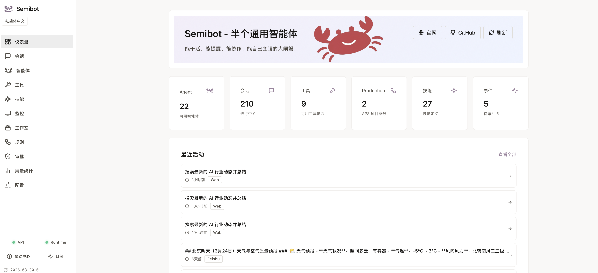

# Semibot

[中文](./README.zh-CN.md) | [English](./README.en.md) | [日本語](./README.ja.md)

[官网](https://semibot.ai) | [帮助中心](https://semibot.ai/help) | [安装指南](https://semibot.ai/help/install) | [CLI 文档](https://semibot.ai/help/cli)

Semibot 是一个本地优先、可安装的 AI 助手与智能体工作台。它能查资料、写内容、处理文件、执行本地与浏览器任务，也能把同一套助手扩展到 Telegram、飞书等 Bot 入口。

## 产品截图



## 可以先这样试

- 查一个主题，整理结论，并把结果留在同一个本地工作区里
- 先起草回复或方案，再继续处理文件、命令或浏览器步骤
- 先在 Web UI 里跑通同一套助手，再扩展到 Telegram 或飞书
- 在团队或生产风格流程里，为高风险动作加上审批检查

## 为什么是 Semibot

- 本地优先运行，而不是托管黑盒
- 不是单一聊天页或 demo 脚本，而是可安装产品
- Web UI、CLI、API、runtime 一体化
- 对高风险操作设置审批门
- 支持网页入口和消息渠道的多入口工作流

## 它能做什么

- 查资料并整理结论
- 起草回复、方案和更长内容
- 处理文件、目录和重复性数据工作
- 执行本地命令和浏览器任务
- 做提醒、跟进和更长链路的任务流
- 把同一套助手扩展到 Telegram、飞书等渠道

## 快速开始

```bash
curl -fsSL https://releases.semibot.ai/install.sh | bash
semibot init
semibot ui
```

推荐平台：macOS 和 Linux。Windows 建议使用 WSL。

三步开始：

1. 先把 Semibot 安装到本地
2. 运行 `semibot init` 完成本地初始化
3. 运行 `semibot ui` 打开本地入口并继续配置

默认 release 端点：

- 安装脚本：`https://releases.semibot.ai/install.sh`
- 更新清单：`https://releases.semibot.ai/stable/latest.json`
- Release 基础 URL：`https://releases.semibot.ai/stable`

## 文档

- 官网：`https://semibot.ai`
- 帮助中心：`https://semibot.ai/help`
- 安装指南：`https://semibot.ai/help/install`
- CLI 文档：`https://semibot.ai/help/cli`
- Bot 配置教程：`https://semibot.ai/help/bot-setup`

## 架构

- `apps/web`: Next.js Web UI
- `apps/api`: Node.js API
- `runtime`: Python runtime、CLI、内建 supervisor
- `packages/*`: 共享配置和类型

这个仓库包含 Semibot Core 代码，可用于构建可安装产品和本地优先运行时。

## 产品亮点

- 简单任务可以直接处理，复杂任务可以走更有结构的路径
- 本地和浏览器执行更贴近真实工作环境
- 成功跑通的流程可以复用，不必每次从零重建
- 一个聊天入口也能拆成多个并行工作线程
- 强模型用于深度思考，轻模型用于执行和整理，更利于速度与成本平衡

## 入口形态

- `Web UI`：在一个本地界面里处理聊天、任务、审批和状态查看
- `CLI`：适合快速运行任务、脚本化操作和终端工作流
- `Channels`：在需要时把同一套助手扩展到 Telegram、飞书、Discord、WhatsApp 和 iMessage

## 本地开发

前置依赖：

- Node.js `20+`
- `pnpm 9+`
- Python `3.11+`

安装依赖：

```bash
pnpm install
python3 -m venv runtime/.venv
runtime/.venv/bin/pip install -r runtime/requirements.txt
```

启动完整开发栈：

```bash
pnpm dev
```

分别启动服务：

```bash
pnpm --dir apps/api dev
pnpm --dir apps/web dev
cd runtime && .venv/bin/python -m src.main serve start
```

常用 runtime 命令：

```bash
cd runtime
python -m src.main init
python -m src.main up
python -m src.main status
python -m src.main ui --no-open
```

## 核心场景

- 想让 AI 真正参与工作的个人用户，而不只是单轮聊天
- 需要共享助手、统一入口和关键步骤人工确认的团队
- 需要工具、文件、命令和后续执行的工作流
- 想让同一套助手同时进入 Web UI、CLI、Telegram、飞书等多入口场景

## 路线方向

- 更好的开箱即用任务 demo
- 更强的审批与恢复体验
- 更多可安装 connector 和 runtime skill
- 更清晰的从个人 agent 到团队部署路径

## 获取帮助

- 安装指南：`https://semibot.ai/help/install`
- CLI 文档：`https://semibot.ai/help/cli`
- Bot 配置教程：`https://semibot.ai/help/bot-setup`
- 飞书指南：`https://semibot.ai/help/feishu`
- Telegram 指南：`https://semibot.ai/help/telegram`
- Discord 指南：`https://semibot.ai/help/discord`
- WhatsApp 指南：`https://semibot.ai/help/whatsapp`
- iMessage 指南：`https://semibot.ai/help/imessage`

## 贡献

欢迎外部贡献，相关说明见：

- `CONTRIBUTING.md`
- `CLA.md`
- `LICENSE`
- `TRADEMARKS.md`

## 维护者

Release 构建：

```bash
./scripts/build_release.sh
```

常用构建参数：

```bash
SKIP_BUILD=1 ./scripts/build_release.sh
INCLUDE_NODE_MODULES=1 ./scripts/build_release.sh
INCLUDE_RUNTIME_VENV=1 ./scripts/build_release.sh
```

常用验证：

```bash
pnpm --dir apps/api type-check
python3 -m pytest runtime/tests/test_cli.py -q
python3 -m compileall runtime/src
```
