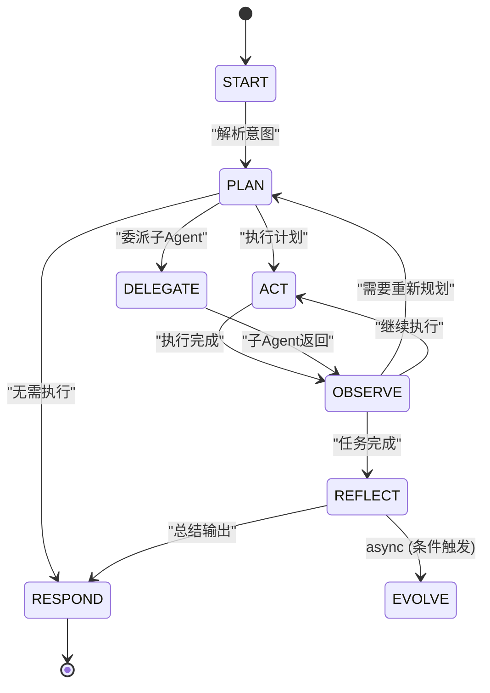
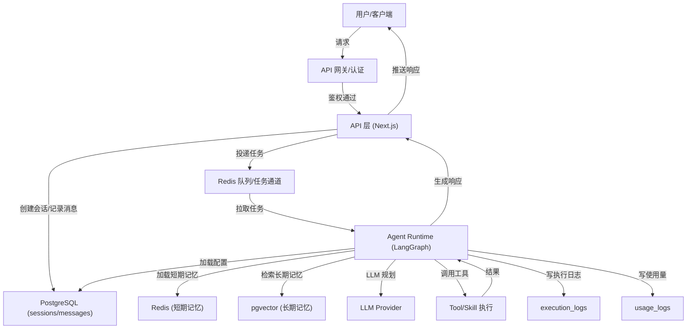
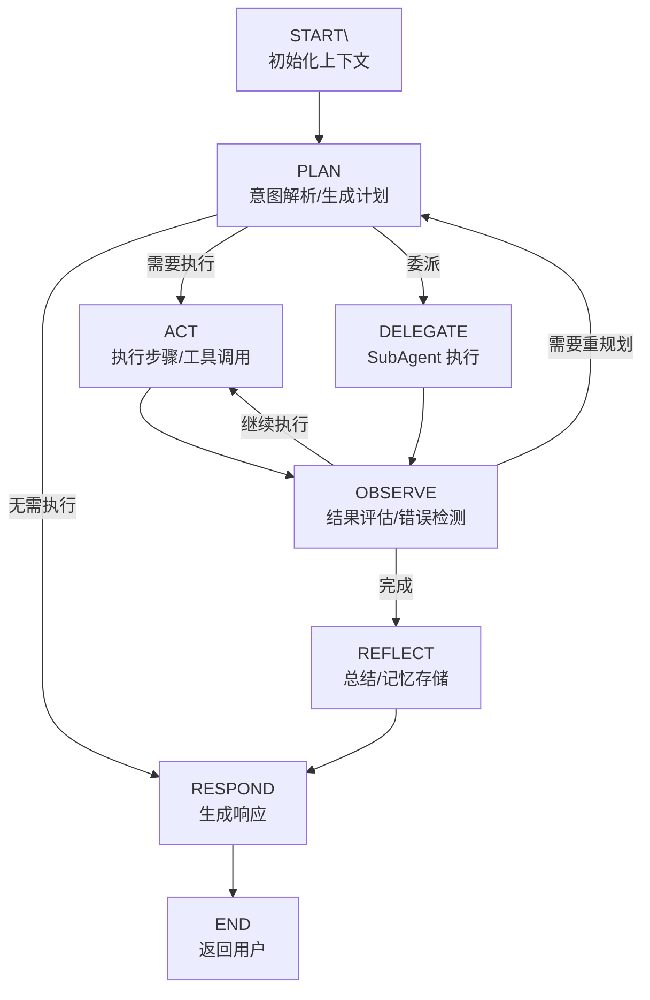

# Agent Runtime 设计

## 1. 概述

Agent Runtime 是基于 Python 的智能体执行引擎，负责 Agent 逻辑的实际执行。采用 LangGraph 实现状态图编排，支持多 SubAgent 协作和 Skill/Tool 调用。

**技术栈**:

- Python 3.11+
- LangChain / LangGraph
- 部署: Modal / Fly.io (Serverless Container)

## 2. 核心状态机

基于原始需求的核心执行流程设计：

```text
用户输入 → 意图解析/计划生成 → 执行/工具调用 → 观察/反馈 → 自我优化/学习
```

### 2.1 状态图（完整流程）



### 2.1.1 系统级核心流程图（端到端）



### 2.1.2 Runtime 内部执行流程（细化）



### 2.2 状态说明

| 状态 | 对应需求流程 | 职责 |
| ---- | ------------ | ---- |
| **START** | 用户输入目标 | 初始化上下文、加载短期/长期记忆 |
| **PLAN** | 意图解析与计划生成 | 解析用户需求、生成执行计划、拆解步骤 |
| **ACT** | 执行步骤与工具调用 | 执行 Skill/Tool（支持并行） |
| **DELEGATE** | 执行步骤与工具调用 | 委派给 SubAgent 处理子任务 |
| **OBSERVE** | 观察结果与反馈 | 结果检查、错误检测、反馈修正 |
| **REFLECT** | 自我优化与学习 | 任务反思、经验总结、记忆存储 |
| **EVOLVE** | 自我进化与技能生成 | 异步提取可复用技能、验证、注册到技能库（详见 [EVOLUTION.md](./EVOLUTION.md)） |
| **RESPOND** | - | 生成最终响应给用户 |

### 2.3 并行执行支持

`ACT` 状态支持并行执行多个工具调用：

```text
                    ┌─────────────┐
                    │    PLAN     │
                    │  生成计划   │
                    └──────┬──────┘
                           │
              ┌────────────┼────────────┐
              │            │            │
              ▼            ▼            ▼
        ┌─────────┐  ┌─────────┐  ┌─────────┐
        │ Tool A  │  │ Tool B  │  │ Tool C  │
        │ (并行)  │  │ (并行)  │  │ (并行)  │
        └────┬────┘  └────┬────┘  └────┬────┘
              │            │            │
              └────────────┼────────────┘
                           │
                           ▼
                    ┌─────────────┐
                    │   OBSERVE   │
                    │  汇总结果   │
                    └─────────────┘
```

### 2.4 执行契约（关键字段与幂等）

- **session_id**: 全链路追踪主键（API -> Runtime -> Logs）
- **step_id**: 计划步骤唯一标识，用于幂等执行与重试
- **action_id**: Tool/Skill 调用标识，用于聚合日志与性能指标
- **message_id**: 响应/中间消息的存储主键

**幂等策略**:

- Runtime 在执行 `step_id` 前检查 `execution_logs` 是否存在成功记录，存在则跳过。
- Tool/Skill 执行失败允许重试，但需记录 `retry_count` 与 `error_code`。

### 2.5 错误与超时处理

- **LLM 调用**: 超时或错误时指数退避重试，最大 `retry_attempts`。
- **Tool 调用**: 超时后进入 OBSERVE，触发重新规划或降级策略。
- **不可恢复错误**: 写入 execution_logs 并返回可读错误提示。

## 3. 核心组件

### 3.1 编排器 (Orchestrator)

```python
from langgraph.graph import StateGraph, END
from typing import TypedDict, Literal
import asyncio

class AgentState(TypedDict):
    messages: list[dict]
    current_step: str
    plan: dict                  # 执行计划
    pending_actions: list[dict] # 待执行的动作列表
    tool_results: list[dict]
    memory_context: str
    reflection: str             # 反思总结
    iteration: int

def create_agent_graph(agent_config: dict) -> StateGraph:
    graph = StateGraph(AgentState)
    
    # 添加节点 - 对应需求流程
    graph.add_node("start", start_node)       # 用户输入目标
    graph.add_node("plan", plan_node)         # 意图解析与计划生成
    graph.add_node("act", act_node)           # 执行步骤与工具调用
    graph.add_node("delegate", delegate_node) # 委派子Agent
    graph.add_node("observe", observe_node)   # 观察结果与反馈
    graph.add_node("reflect", reflect_node)   # 自我优化与学习
    graph.add_node("respond", respond_node)   # 生成响应
    
    # 设置入口
    graph.set_entry_point("start")
    graph.add_edge("start", "plan")
    
    # PLAN 后的条件路由
    graph.add_conditional_edges(
        "plan",
        route_after_plan,
        {
            "act": "act",
            "delegate": "delegate",
            "respond": "respond"  # 简单问题直接回复
        }
    )
    
    graph.add_edge("act", "observe")
    graph.add_edge("delegate", "observe")
    
    # OBSERVE 后的条件路由
    graph.add_conditional_edges(
        "observe",
        route_after_observe,
        {
            "replan": "plan",    # 需要重新规划
            "continue": "act",   # 继续执行下一步
            "reflect": "reflect" # 任务完成，进入反思
        }
    )
    
    graph.add_edge("reflect", "respond")

    # EVOLVE: 异步进化（不阻塞主流程）
    # 在 reflect_node 内部通过 EvolutionEngine.maybe_evolve() 触发
    # 详见 EVOLUTION.md

    graph.add_edge("respond", END)
    
    return graph.compile()


# ===== 节点实现 =====

async def start_node(state: AgentState) -> AgentState:
    """初始化：加载记忆上下文"""
    memory = await load_memory(state["messages"])
    return {**state, "memory_context": memory, "iteration": 0}


async def plan_node(state: AgentState) -> AgentState:
    """意图解析与计划生成"""
    # 检索进化技能库（详见 EVOLUTION.md）
    evolved_skills = await search_evolved_skills(
        query=state["messages"][-1]["content"],
        agent_id=state.get("agent_id"),
        limit=5
    )

    plan = await llm.generate_plan(
        messages=state["messages"],
        memory=state["memory_context"],
        available_evolved_skills=evolved_skills
    )
    # plan 结构: {"goal": "...", "steps": [...], "parallel_actions": [...]}
    return {**state, "plan": plan, "pending_actions": plan.get("steps", [])}


async def act_node(state: AgentState) -> AgentState:
    """执行工具调用 - 支持并行"""
    actions = state["pending_actions"]
    
    # 并行执行所有可并行的动作
    parallel_tasks = [
        tool_registry.execute(action["tool"], action["params"])
        for action in actions
        if action.get("parallel", False)
    ]
    
    if parallel_tasks:
        results = await asyncio.gather(*parallel_tasks, return_exceptions=True)
    else:
        # 串行执行
        results = []
        for action in actions:
            result = await tool_registry.execute(action["tool"], action["params"])
            results.append(result)
    
    return {**state, "tool_results": results, "pending_actions": []}


async def observe_node(state: AgentState) -> AgentState:
    """观察结果，决定下一步"""
    observation = await llm.analyze_results(
        plan=state["plan"],
        results=state["tool_results"],
        messages=state["messages"]
    )
    return {**state, "current_step": observation["next_step"]}


async def reflect_node(state: AgentState) -> AgentState:
    """自我反思与学习"""
    # 生成反思总结
    reflection = await llm.reflect(
        messages=state["messages"],
        plan=state["plan"],
        results=state["tool_results"]
    )
    
    # 存储有价值的经验到长期记忆
    if reflection.get("worth_remembering"):
        await memory_system.save_long_term(
            content=reflection["summary"],
            importance=reflection["importance"]
        )

    # 触发异步进化（条件判断在 EvolutionEngine 内部）
    evolution_engine = EvolutionEngine(llm, memory_system, skill_registry, db_pool)
    await evolution_engine.maybe_evolve(state)
    
    return {**state, "reflection": reflection["summary"]}


async def respond_node(state: AgentState) -> AgentState:
    """生成最终响应"""
    response = await llm.generate_response(
        messages=state["messages"],
        results=state["tool_results"],
        reflection=state.get("reflection", "")
    )
    state["messages"].append({"role": "assistant", "content": response})
    return state
```

### 3.2 Tool 执行器

```python
from abc import ABC, abstractmethod

class BaseTool(ABC):
    """工具基类"""
    
    @property
    @abstractmethod
    def name(self) -> str:
        pass
    
    @property
    @abstractmethod
    def schema(self) -> dict:
        """OpenAI function calling 格式的参数定义"""
        pass
    
    @abstractmethod
    async def execute(self, **params) -> dict:
        """执行工具"""
        pass

class ToolRegistry:
    """工具注册中心"""
    
    def __init__(self):
        self._tools: dict[str, BaseTool] = {}
    
    def register(self, tool: BaseTool):
        self._tools[tool.name] = tool
    
    def get(self, name: str) -> BaseTool | None:
        return self._tools.get(name)
    
    def get_schemas(self) -> list[dict]:
        return [t.schema for t in self._tools.values()]
    
    async def execute(self, name: str, params: dict) -> dict:
        tool = self.get(name)
        if not tool:
            return {"error": f"Tool {name} not found"}
        
        try:
            return await tool.execute(**params)
        except Exception as e:
            return {"error": str(e)}
```

### 3.3 Skill 执行器

Skill 是能力单元，封装一组相关的 Tools，提供更高层次的抽象。

```text
┌─────────────────────────────────────────────────┐
│                    Agent                        │
├─────────────────────────────────────────────────┤
│   ┌─────────────┐   ┌─────────────┐            │
│   │   Skill A   │   │   Skill B   │            │
│   │ (web_search)│   │(code_execute)│           │
│   ├─────────────┤   ├─────────────┤            │
│   │ Tool: search│   │ Tool: run   │            │
│   │ Tool: fetch │   │ Tool: install│           │
│   └─────────────┘   └─────────────┘            │
└─────────────────────────────────────────────────┘
```

```python
from abc import ABC, abstractmethod
from dataclasses import dataclass

@dataclass
class SkillConfig:
    """Skill 配置"""
    name: str
    description: str
    trigger_keywords: list[str]
    tools: list[str]  # 关联的 Tool IDs
    config: dict = None

class BaseSkill(ABC):
    """Skill 基类"""
    
    def __init__(self, config: SkillConfig, tool_registry: ToolRegistry):
        self.config = config
        self.tool_registry = tool_registry
    
    @property
    def name(self) -> str:
        return self.config.name
    
    @property
    def description(self) -> str:
        return self.config.description
    
    @property
    def trigger_keywords(self) -> list[str]:
        return self.config.trigger_keywords
    
    def matches(self, text: str) -> bool:
        """检查文本是否匹配此 Skill 的触发关键词"""
        text_lower = text.lower()
        return any(kw.lower() in text_lower for kw in self.trigger_keywords)
    
    @abstractmethod
    async def execute(self, context: dict) -> dict:
        """执行 Skill 逻辑，可调用多个 Tools"""
        pass
    
    async def call_tool(self, tool_name: str, params: dict) -> dict:
        """调用关联的 Tool"""
        if tool_name not in self.config.tools:
            return {"error": f"Tool {tool_name} not in skill {self.name}"}
        return await self.tool_registry.execute(tool_name, params)


class SkillRegistry:
    """Skill 注册中心"""
    
    def __init__(self, tool_registry: ToolRegistry):
        self._skills: dict[str, BaseSkill] = {}
        self.tool_registry = tool_registry
    
    def register(self, skill: BaseSkill):
        self._skills[skill.name] = skill
    
    def get(self, name: str) -> BaseSkill | None:
        return self._skills.get(name)
    
    def match_skill(self, text: str) -> BaseSkill | None:
        """根据文本匹配合适的 Skill"""
        for skill in self._skills.values():
            if skill.matches(text):
                return skill
        return None
    
    def get_all_schemas(self) -> list[dict]:
        """获取所有 Skills 的描述（用于 LLM）"""
        return [
            {
                "name": s.name,
                "description": s.description,
                "trigger_keywords": s.trigger_keywords
            }
            for s in self._skills.values()
        ]
    
    async def execute(self, name: str, context: dict) -> dict:
        skill = self.get(name)
        if not skill:
            return {"error": f"Skill {name} not found"}
        
        try:
            return await skill.execute(context)
        except Exception as e:
            return {"error": str(e)}


# ===== 内置 Skill 示例 =====

class WebSearchSkill(BaseSkill):
    """网页搜索技能"""
    
    async def execute(self, context: dict) -> dict:
        query = context.get("query", "")
        
        # 调用搜索 Tool
        search_result = await self.call_tool("search_api", {"query": query})
        
        if search_result.get("error"):
            return search_result
        
        # 可选：调用网页抓取 Tool 获取详情
        urls = search_result.get("urls", [])[:3]
        details = []
        for url in urls:
            page = await self.call_tool("fetch_page", {"url": url})
            details.append(page)
        
        return {
            "search_results": search_result,
            "page_details": details
        }


# ===== 浏览器工具 =====

class BrowserTool(BaseTool):
    """浏览器控制工具 - 基于 Playwright"""
    
    name = "browser"
    
    @property
    def schema(self) -> dict:
        return {
            "name": "browser",
            "description": "Control a web browser to navigate, interact, and extract information from web pages",
            "parameters": {
                "type": "object",
                "properties": {
                    "action": {
                        "type": "string",
                        "enum": ["navigate", "snapshot", "screenshot", "click", "type", "scroll", "wait", "evaluate", "extract"],
                        "description": "The browser action to perform"
                    },
                    "url": {"type": "string", "description": "URL to navigate to (for 'navigate' action)"},
                    "selector": {"type": "string", "description": "CSS selector or XPath for element targeting"},
                    "ref": {"type": "integer", "description": "Element reference from semantic snapshot"},
                    "text": {"type": "string", "description": "Text to type (for 'type' action)"},
                    "script": {"type": "string", "description": "JavaScript to execute (for 'evaluate' action)"},
                    "full_page": {"type": "boolean", "default": False, "description": "Capture full page screenshot"}
                },
                "required": ["action"]
            }
        }
    
    def __init__(self, config: dict = None):
        self.config = config or {}
        self.browser = None
        self.page = None
        self._element_refs: dict[int, str] = {}  # ref -> selector mapping
    
    async def _ensure_browser(self):
        """确保浏览器实例已启动"""
        if not self.browser:
            from playwright.async_api import async_playwright
            playwright = await async_playwright().start()
            self.browser = await playwright.chromium.launch(
                headless=self.config.get("headless", True)
            )
            self.page = await self.browser.new_page(
                viewport=self.config.get("viewport", {"width": 1280, "height": 720})
            )
    
    async def execute(self, action: str, **params) -> dict:
        """执行浏览器动作"""
        await self._ensure_browser()
        
        actions = {
            "navigate": self._navigate,
            "snapshot": self._semantic_snapshot,
            "screenshot": self._screenshot,
            "click": self._click,
            "type": self._type,
            "scroll": self._scroll,
            "wait": self._wait,
            "evaluate": self._evaluate,
            "extract": self._extract,
        }
        
        handler = actions.get(action)
        if not handler:
            return {"error": f"Unknown action: {action}"}
        
        try:
            return await handler(**params)
        except Exception as e:
            return {"error": str(e), "action": action}
    
    async def _navigate(self, url: str, **kwargs) -> dict:
        """导航到指定 URL"""
        await self.page.goto(url, wait_until="domcontentloaded")
        return {"success": True, "url": self.page.url, "title": await self.page.title()}
    
    async def _semantic_snapshot(self, selector: str = None, **kwargs) -> dict:
        """
        获取语义快照 - 通过 ARIA 树生成结构化页面表示
        相比截图更高效：体积小 (<50KB vs 5MB)，解析快，交互精确
        """
        # 获取可访问性树
        snapshot = await self.page.accessibility.snapshot(
            interesting_only=True,
            root=await self.page.query_selector(selector) if selector else None
        )
        
        # 转换为结构化文本并生成元素引用
        self._element_refs = {}
        ref_counter = [0]
        
        def node_to_text(node: dict, depth: int = 0) -> str:
            if not node:
                return ""
            
            lines = []
            indent = "│  " * depth
            prefix = "├─ " if depth > 0 else ""
            
            role = node.get("role", "")
            name = node.get("name", "")
            
            # 为可交互元素分配引用
            ref_str = ""
            if role in ("button", "link", "textbox", "checkbox", "menuitem", "tab"):
                ref_counter[0] += 1
                ref = ref_counter[0]
                self._element_refs[ref] = self._generate_selector(node)
                ref_str = f" ref={ref}"
            
            node_text = f"[{role}{ref_str}]"
            if name:
                node_text += f" {name}"
            
            lines.append(f"{indent}{prefix}{node_text}")
            
            for child in node.get("children", []):
                lines.append(node_to_text(child, depth + 1))
            
            return "\n".join(filter(None, lines))
        
        text_tree = node_to_text(snapshot)
        
        return {
            "snapshot": text_tree,
            "refs": self._element_refs,
            "url": self.page.url,
            "title": await self.page.title()
        }
    
    def _generate_selector(self, node: dict) -> str:
        """根据节点属性生成 CSS 选择器"""
        role = node.get("role", "")
        name = node.get("name", "")
        
        # 优先使用 role + name 组合
        if role and name:
            return f"[role='{role}'][aria-label='{name}'], {role}:has-text('{name}')"
        return f"[role='{role}']" if role else "*"
    
    async def _click(self, selector: str = None, ref: int = None, **kwargs) -> dict:
        """点击元素 - 支持选择器或语义引用"""
        target = selector or self._element_refs.get(ref)
        if not target:
            return {"error": "No selector or valid ref provided"}
        
        await self.page.click(target)
        return {"success": True, "clicked": target}
    
    async def _type(self, selector: str, text: str, **kwargs) -> dict:
        """在元素中输入文本"""
        await self.page.fill(selector, text)
        return {"success": True, "typed": text}
    
    async def _screenshot(self, selector: str = None, full_page: bool = False, **kwargs) -> dict:
        """截取屏幕截图"""
        import base64
        
        options = {"full_page": full_page}
        if selector:
            element = await self.page.query_selector(selector)
            screenshot = await element.screenshot() if element else await self.page.screenshot(**options)
        else:
            screenshot = await self.page.screenshot(**options)
        
        return {
            "screenshot": base64.b64encode(screenshot).decode(),
            "format": "png"
        }
    
    async def _scroll(self, direction: str = "down", amount: int = 500, **kwargs) -> dict:
        """滚动页面"""
        delta = amount if direction == "down" else -amount
        await self.page.mouse.wheel(0, delta)
        return {"success": True, "scrolled": delta}
    
    async def _wait(self, selector: str, state: str = "visible", timeout: int = 30000, **kwargs) -> dict:
        """等待元素状态"""
        await self.page.wait_for_selector(selector, state=state, timeout=timeout)
        return {"success": True, "selector": selector, "state": state}
    
    async def _evaluate(self, script: str, **kwargs) -> dict:
        """执行 JavaScript"""
        result = await self.page.evaluate(script)
        return {"result": result}
    
    async def _extract(self, selectors: dict, **kwargs) -> dict:
        """提取页面数据"""
        data = {}
        for key, selector in selectors.items():
            elements = await self.page.query_selector_all(selector)
            data[key] = [await el.text_content() for el in elements]
        return {"data": data}
    
    async def close(self):
        """关闭浏览器"""
        if self.browser:
            await self.browser.close()
            self.browser = None
            self.page = None


# ===== 浏览器技能示例 =====

class WebScrapingSkill(BaseSkill):
    """网页抓取技能 - 结合浏览器工具实现复杂抓取"""
    
    async def execute(self, context: dict) -> dict:
        url = context.get("url")
        extract_config = context.get("extract", {})
        
        # 1. 导航到目标页面
        nav_result = await self.call_tool("browser", {
            "action": "navigate",
            "url": url
        })
        
        if nav_result.get("error"):
            return nav_result
        
        # 2. 获取语义快照用于理解页面结构
        snapshot = await self.call_tool("browser", {
            "action": "snapshot"
        })
        
        # 3. 根据配置提取数据
        if extract_config:
            data = await self.call_tool("browser", {
                "action": "extract",
                "selectors": extract_config
            })
            return {
                "url": url,
                "title": nav_result.get("title"),
                "snapshot": snapshot.get("snapshot"),
                "extracted_data": data.get("data")
            }
        
        return {
            "url": url,
            "title": nav_result.get("title"),
            "snapshot": snapshot.get("snapshot")
        }


# ===== 统一动作执行器 =====

class ActionExecutor:
    """统一的动作执行器，整合 Skill 和 Tool"""
    
    def __init__(self, skill_registry: SkillRegistry, tool_registry: ToolRegistry):
        self.skill_registry = skill_registry
        self.tool_registry = tool_registry
    
    async def execute(self, action: dict) -> dict:
        """
        执行动作，自动区分 Skill 和 Tool
        action: {"type": "skill"|"tool", "name": "...", "params": {...}}
        """
        action_type = action.get("type", "tool")
        name = action["name"]
        params = action.get("params", {})
        
        if action_type == "skill":
            return await self.skill_registry.execute(name, params)
        else:
            return await self.tool_registry.execute(name, params)
    
    async def execute_parallel(self, actions: list[dict]) -> list[dict]:
        """并行执行多个动作"""
        import asyncio
        tasks = [self.execute(action) for action in actions]
        return await asyncio.gather(*tasks, return_exceptions=True)
```

### 3.4 SubAgent 委派

```python
class SubAgentDelegator:
    """SubAgent 委派器"""
    
    async def delegate(
        self,
        sub_agent_id: str,
        task: str,
        context: dict
    ) -> dict:
        # 加载子 Agent 配置
        sub_agent = await self.load_agent(sub_agent_id)
        
        # 创建子 Agent 执行图
        sub_graph = create_agent_graph(sub_agent.config)
        
        # 执行子 Agent
        result = await sub_graph.ainvoke({
            "messages": [{"role": "user", "content": task}],
            "memory_context": context.get("memory", ""),
            "iteration": 0
        })
        
        return {
            "agent_id": sub_agent_id,
            "result": result["messages"][-1]["content"]
        }
```

## 4. LLM 适配层

```python
from abc import ABC, abstractmethod
from openai import AsyncOpenAI
from anthropic import AsyncAnthropic

class LLMProvider(ABC):
    @abstractmethod
    async def chat(
        self,
        messages: list[dict],
        tools: list[dict] | None = None,
        **kwargs
    ) -> dict:
        pass

class OpenAIProvider(LLMProvider):
    def __init__(self, model: str = "gpt-4o"):
        self.client = AsyncOpenAI()
        self.model = model
    
    async def chat(self, messages, tools=None, **kwargs):
        response = await self.client.chat.completions.create(
            model=self.model,
            messages=messages,
            tools=tools,
            **kwargs
        )
        return response.choices[0].message

class AnthropicProvider(LLMProvider):
    def __init__(self, model: str = "claude-3-sonnet"):
        self.client = AsyncAnthropic()
        self.model = model
    
    async def chat(self, messages, tools=None, **kwargs):
        # 转换为 Anthropic 格式
        response = await self.client.messages.create(
            model=self.model,
            messages=self._convert_messages(messages),
            tools=self._convert_tools(tools) if tools else None,
            **kwargs
        )
        return self._convert_response(response)

def get_provider(model: str) -> LLMProvider:
    if model.startswith("gpt") or model.startswith("o1"):
        return OpenAIProvider(model)
    elif model.startswith("claude"):
        return AnthropicProvider(model)
    else:
        raise ValueError(f"Unknown model: {model}")
```

## 5. 记忆系统集成

```python
import redis.asyncio as redis
from pgvector.asyncpg import register_vector
import asyncpg

class MemorySystem:
    """分层记忆系统"""
    
    def __init__(self, redis_url: str, pg_url: str):
        self.redis = redis.from_url(redis_url)
        self.pg_pool = None
        self.pg_url = pg_url
    
    async def init_pg(self):
        self.pg_pool = await asyncpg.create_pool(self.pg_url)
        async with self.pg_pool.acquire() as conn:
            await register_vector(conn)
    
    # 短期记忆 (Redis)
    async def get_short_term(self, session_id: str) -> list[dict]:
        data = await self.redis.get(f"session:{session_id}:messages")
        return json.loads(data) if data else []
    
    async def save_short_term(self, session_id: str, messages: list[dict]):
        await self.redis.setex(
            f"session:{session_id}:messages",
            3600 * 24,  # 24小时过期
            json.dumps(messages)
        )
    
    # 长期记忆 (pgvector)
    async def search_long_term(
        self,
        agent_id: str,
        query_embedding: list[float],
        limit: int = 5
    ) -> list[dict]:
        async with self.pg_pool.acquire() as conn:
            rows = await conn.fetch("""
                SELECT content, memory_type, importance,
                       1 - (embedding <=> $1) as similarity
                FROM memories
                WHERE agent_id = $2
                ORDER BY embedding <=> $1
                LIMIT $3
            """, query_embedding, agent_id, limit)
            
            return [dict(r) for r in rows]
    
    async def save_long_term(
        self,
        agent_id: str,
        content: str,
        embedding: list[float],
        memory_type: str = "semantic"
    ):
        async with self.pg_pool.acquire() as conn:
            await conn.execute("""
                INSERT INTO memories (agent_id, content, embedding, memory_type)
                VALUES ($1, $2, $3, $4)
            """, agent_id, content, embedding, memory_type)
```

## 6. 错误处理与重试

```python
from tenacity import retry, stop_after_attempt, wait_exponential
from dataclasses import dataclass, field
from typing import Optional
import os

@dataclass
class ExecutionConfig:
    """
    Agent 执行配置

    所有配置值应从环境变量或配置文件加载，避免硬编码。
    默认值仅作为后备，生产环境应显式配置。
    """
    # 执行控制
    max_iterations: int = field(
        default_factory=lambda: int(os.getenv("AGENT_MAX_ITERATIONS", "10"))
    )

    # 超时配置（秒）
    tool_timeout: int = field(
        default_factory=lambda: int(os.getenv("AGENT_TOOL_TIMEOUT", "30"))
    )
    llm_timeout: int = field(
        default_factory=lambda: int(os.getenv("AGENT_LLM_TIMEOUT", "60"))
    )

    # 重试配置
    retry_attempts: int = field(
        default_factory=lambda: int(os.getenv("AGENT_RETRY_ATTEMPTS", "3"))
    )
    retry_min_wait: int = field(
        default_factory=lambda: int(os.getenv("AGENT_RETRY_MIN_WAIT", "1"))
    )
    retry_max_wait: int = field(
        default_factory=lambda: int(os.getenv("AGENT_RETRY_MAX_WAIT", "10"))
    )

    # 并发控制
    max_parallel_tools: int = field(
        default_factory=lambda: int(os.getenv("AGENT_MAX_PARALLEL_TOOLS", "5"))
    )

    # 记忆配置
    short_term_memory_ttl: int = field(
        default_factory=lambda: int(os.getenv("AGENT_SHORT_TERM_TTL", "86400"))  # 24小时
    )
    long_term_memory_limit: int = field(
        default_factory=lambda: int(os.getenv("AGENT_LONG_TERM_LIMIT", "10"))
    )

    @classmethod
    def from_env(cls) -> "ExecutionConfig":
        """从环境变量加载配置"""
        return cls()

    @classmethod
    def from_dict(cls, config: dict) -> "ExecutionConfig":
        """从字典加载配置"""
        return cls(
            max_iterations=config.get("max_iterations", 10),
            tool_timeout=config.get("tool_timeout", 30),
            llm_timeout=config.get("llm_timeout", 60),
            retry_attempts=config.get("retry_attempts", 3),
            retry_min_wait=config.get("retry_min_wait", 1),
            retry_max_wait=config.get("retry_max_wait", 10),
            max_parallel_tools=config.get("max_parallel_tools", 5),
            short_term_memory_ttl=config.get("short_term_memory_ttl", 86400),
            long_term_memory_limit=config.get("long_term_memory_limit", 10),
        )


def create_retry_decorator(config: ExecutionConfig):
    """根据配置创建重试装饰器"""
    return retry(
        stop=stop_after_attempt(config.retry_attempts),
        wait=wait_exponential(
            multiplier=1,
            min=config.retry_min_wait,
            max=config.retry_max_wait
        )
    )

# 使用示例
config = ExecutionConfig.from_env()
retry_decorator = create_retry_decorator(config)

@retry_decorator
async def execute_with_retry(func, *args, **kwargs):
    return await func(*args, **kwargs)

class AgentExecutor:
    async def run(self, state: AgentState) -> AgentState:
        config = self.config
        
        for i in range(config.max_iterations):
            state["iteration"] = i
            
            try:
                state = await self.graph.ainvoke(state)
                
                if state["current_step"] == "respond":
                    break
                    
            except ToolTimeoutError:
                state["messages"].append({
                    "role": "system",
                    "content": "工具执行超时，请尝试其他方法"
                })
            except LLMError as e:
                if i < config.retry_attempts:
                    continue
                raise
        
        return state
```

## 7. 与 API 层集成

### 消息队列通信

```python
# Worker 启动入口
async def worker_main():
    redis = await aioredis.from_url(REDIS_URL)
    
    while True:
        # 从队列获取任务
        task = await redis.brpop("agent:tasks", timeout=30)
        if not task:
            continue
        
        task_data = json.loads(task[1])
        
        # 执行 Agent
        executor = AgentExecutor(task_data["agent_config"])
        result = await executor.run({
            "messages": task_data["messages"],
            "iteration": 0
        })
        
        # 发布结果
        await redis.publish(
            f"agent:results:{task_data['session_id']}",
            json.dumps(result)
        )
```

## 8. 部署配置

### Modal 部署示例

```python
import modal

app = modal.App("semibot-runtime")

image = modal.Image.debian_slim(python_version="3.11").pip_install(
    "langchain", "langgraph", "openai", "anthropic",
    "redis", "asyncpg", "pgvector"
)

@app.function(image=image, secrets=[modal.Secret.from_name("semibot-secrets")])
async def run_agent(agent_config: dict, messages: list) -> dict:
    executor = AgentExecutor(agent_config)
    return await executor.run({"messages": messages, "iteration": 0})
```

## 9. 性能监控与日志

### 9.1 关键指标 (Metrics)

```python
from dataclasses import dataclass
from time import time
from typing import Optional
import asyncio

@dataclass
class ExecutionMetrics:
    """执行指标数据"""
    session_id: str
    agent_id: str
    
    # 时间指标
    total_duration_ms: int = 0
    plan_duration_ms: int = 0
    act_duration_ms: int = 0
    llm_latency_ms: int = 0
    tool_latency_ms: int = 0
    
    # Token 指标
    tokens_input: int = 0
    tokens_output: int = 0
    
    # 执行指标
    iterations: int = 0
    tool_calls: int = 0
    skill_calls: int = 0
    errors: int = 0
    
    # 模型信息
    model: str = ""

class MetricsCollector:
    """指标采集器"""
    
    def __init__(self, session_id: str, agent_id: str):
        self.metrics = ExecutionMetrics(session_id=session_id, agent_id=agent_id)
        self._timers: dict[str, float] = {}
    
    def start_timer(self, name: str):
        self._timers[name] = time()
    
    def stop_timer(self, name: str) -> int:
        if name not in self._timers:
            return 0
        duration_ms = int((time() - self._timers[name]) * 1000)
        setattr(self.metrics, f"{name}_duration_ms", duration_ms)
        return duration_ms
    
    def record_tokens(self, input_tokens: int, output_tokens: int):
        self.metrics.tokens_input += input_tokens
        self.metrics.tokens_output += output_tokens
    
    def record_tool_call(self, duration_ms: int):
        self.metrics.tool_calls += 1
        self.metrics.tool_latency_ms += duration_ms
    
    def record_error(self):
        self.metrics.errors += 1
    
    async def flush(self, db_pool, redis_client):
        """持久化指标到数据库和 Redis"""
        # 写入 execution_logs
        await db_pool.execute("""
            INSERT INTO execution_logs 
            (org_id, agent_id, session_id, state, duration_ms, 
             tokens_input, tokens_output, model)
            VALUES ($1, $2, $3, $4, $5, $6, $7, $8)
        """, ...)
        
        # 发布实时指标到 Redis（用于仪表盘）
        await redis_client.publish(
            f"metrics:{self.metrics.agent_id}",
            self.metrics.__dict__
        )
```

### 9.2 执行日志记录

```python
import structlog
from enum import Enum

class LogLevel(Enum):
    DEBUG = "debug"
    INFO = "info"
    WARN = "warn"
    ERROR = "error"

class ExecutionLogger:
    """结构化执行日志"""
    
    def __init__(self, session_id: str, agent_id: str):
        self.logger = structlog.get_logger().bind(
            session_id=session_id,
            agent_id=agent_id
        )
    
    def log_state_transition(self, from_state: str, to_state: str, reason: str = ""):
        self.logger.info(
            "state_transition",
            from_state=from_state,
            to_state=to_state,
            reason=reason
        )
    
    def log_tool_call(self, tool_name: str, params: dict, result: dict, duration_ms: int):
        self.logger.info(
            "tool_call",
            tool_name=tool_name,
            params=params,
            result_preview=str(result)[:200],
            duration_ms=duration_ms,
            success=not result.get("error")
        )
    
    def log_llm_call(self, model: str, tokens_in: int, tokens_out: int, latency_ms: int):
        self.logger.info(
            "llm_call",
            model=model,
            tokens_input=tokens_in,
            tokens_output=tokens_out,
            latency_ms=latency_ms
        )
    
    def log_error(self, error_code: str, message: str, details: dict = None):
        self.logger.error(
            "execution_error",
            error_code=error_code,
            message=message,
            details=details or {}
        )
```

### 9.3 监控仪表盘指标

推荐监控以下指标：

| 指标名 | 类型 | 说明 | 告警阈值 |
| ------ | ---- | ---- | -------- |
| `agent_execution_duration_seconds` | Histogram | 执行耗时分布 | P95 > 30s |
| `agent_tokens_total` | Counter | Token 使用总量 | 超过配额 80% |
| `agent_tool_calls_total` | Counter | 工具调用总数 | - |
| `agent_errors_total` | Counter | 错误总数 | 错误率 > 5% |
| `agent_active_sessions` | Gauge | 活跃会话数 | > 并发限制 |
| `llm_latency_seconds` | Histogram | LLM 响应延迟 | P95 > 10s |
| `tool_latency_seconds` | Histogram | 工具调用延迟 | P95 > 5s |

### 9.4 告警规则示例

```yaml
# Prometheus AlertManager 规则
groups:
  - name: semibot-alerts
    rules:
      - alert: HighExecutionLatency
        expr: histogram_quantile(0.95, agent_execution_duration_seconds) > 30
        for: 5m
        labels:
          severity: warning
        annotations:
          summary: "Agent 执行延迟过高"
          
      - alert: HighErrorRate
        expr: rate(agent_errors_total[5m]) / rate(agent_execution_total[5m]) > 0.05
        for: 5m
        labels:
          severity: critical
        annotations:
          summary: "Agent 错误率超过 5%"
          
      - alert: QuotaNearLimit
        expr: usage_tokens_used / usage_tokens_limit > 0.8
        for: 1h
        labels:
          severity: warning
        annotations:
          summary: "Token 配额使用超过 80%"
```

### 9.5 集成 OpenTelemetry

```python
from opentelemetry import trace
from opentelemetry.sdk.trace import TracerProvider
from opentelemetry.exporter.otlp.proto.grpc.trace_exporter import OTLPSpanExporter

# 初始化 Tracer
provider = TracerProvider()
provider.add_span_processor(
    BatchSpanProcessor(OTLPSpanExporter(endpoint="localhost:4317"))
)
trace.set_tracer_provider(provider)
tracer = trace.get_tracer("semibot.runtime")

# 在执行流程中使用
async def act_node(state: AgentState) -> AgentState:
    with tracer.start_as_current_span("act_node") as span:
        span.set_attribute("agent_id", state["agent_id"])
        span.set_attribute("tools_count", len(state["pending_actions"]))
        
        # 执行逻辑...
        
        span.set_attribute("duration_ms", duration_ms)
        return result
```
