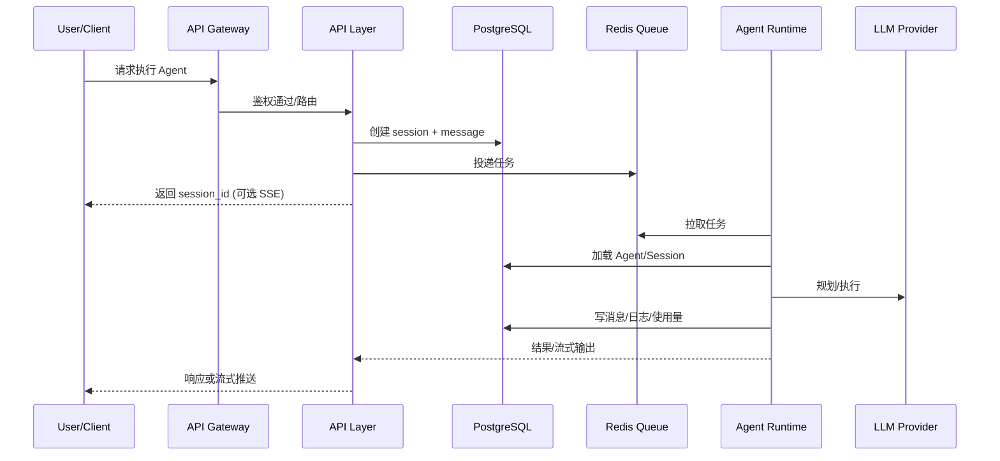

# 系统架构设计

## 1. 架构概览

```text
                            ┌─────────────────┐
                            │   Web Client    │
                            │   (Next.js)     │
                            └────────┬────────┘
                                     │ HTTPS / WebSocket
                                     ▼
┌────────────────────────────────────────────────────────────────────┐
│                         API Gateway (Vercel Edge)                   │
│                    认证 / 限流 / 路由 / WebSocket                    │
└────────────────────────────────────────────────────────────────────┘
                                     │
        ┌────────────────────────────┼────────────────────────────┐
        │                            │                            │
        ▼                            ▼                            ▼
┌───────────────┐          ┌─────────────────┐          ┌─────────────────┐
│  Agent API    │          │   Session API   │          │   Admin API     │
│  (Node.js)    │          │   (Node.js)     │          │   (Node.js)     │
│  Serverless   │          │   Serverless    │          │   Serverless    │
└───────┬───────┘          └────────┬────────┘          └─────────────────┘
        │                           │
        └───────────┬───────────────┘
                    │ Redis Stream
                    ▼
        ┌───────────────────────┐
        │    Agent Runtime      │
        │    (Python Worker)    │
        │                       │
        │  ┌─────────────────┐  │
        │  │  Orchestrator   │  │
        │  │  (状态图编排)    │  │
        │  └────────┬────────┘  │
        │           │           │
        │  ┌────────┴────────┐  │
        │  │                 │  │
        │  ▼                 ▼  │
        │ ┌────┐  ┌────┐ ┌────┐│
        │ │Sub │  │Sub │ │Sub ││
        │ │Agt1│  │Agt2│ │Agt3││
        │ └────┘  └────┘ └────┘│
        └───────────────────────┘
                    │
    ┌───────────────┼───────────────┐
    │               │               │
    ▼               ▼               ▼
┌────────┐    ┌──────────┐    ┌──────────┐
│ Redis  │    │PostgreSQL│    │ LLM APIs │
│ Queue  │    │+ pgvector│    │(多模型)   │
│ Cache  │    │          │    │          │
└────────┘    └──────────┘    └──────────┘
```

## 2. 分层设计

### 2.1 表现层 (Presentation Layer)

**职责**: 用户交互、状态展示

- **技术**: Next.js 14 App Router
- **部署**: Vercel Edge
- **功能**:
  - Agent 管理界面
  - Skill 配置界面
  - 对话交互界面
  - 实时状态展示 (SSE/WebSocket)

### 2.2 API 层 (API Layer)

**职责**: 请求路由、认证授权、数据校验

- **技术**: Vercel Serverless Functions (Node.js)
- **部署**: Vercel
- **功能**:
  - RESTful API 端点
  - WebSocket 网关
  - 请求认证与限流
  - 任务分发到队列

### 2.3 执行层 (Execution Layer)

**职责**: Agent 逻辑执行、编排调度

- **技术**: Python + LangChain/LangGraph
- **部署**: Modal / Fly.io (Serverless Container)
- **功能**:
  - Agent 状态机执行
  - SubAgent 编排
  - Skill/Tool 调用
  - LLM 交互

### 2.4 数据层 (Data Layer)

**职责**: 数据持久化、缓存、队列

| 组件 | 用途 | 服务 |
| ---- | ---- | ---- |
| PostgreSQL | 主数据存储 | Supabase / Neon |
| pgvector | 向量存储(长期记忆) | Supabase |
| Redis | 任务队列、缓存、会话状态 | Upstash |

## 3. 通信模式

### 3.1 同步请求-响应

```text
Client -> API -> Database -> API -> Client
```

适用于: Agent CRUD、Session 管理、配置查询

### 3.2 异步任务队列

```text
Client -> API -> Redis Queue -> Worker -> Redis -> API -> Client
```

适用于: Agent 执行（可能耗时较长）

### 3.3 流式响应 (SSE)

```text
Client <-- SSE <-- API <-- Redis Pub/Sub <-- Worker
```

适用于: 实时对话输出

## 3.4 端到端核心流程（时序）



## 4. 核心组件

### 4.1 Agent Orchestrator

状态图编排器，控制 Agent 执行流程：

```text
┌─────────┐     ┌─────────┐     ┌─────────┐
│  START  │────▶│  THINK  │────▶│  ACT    │
└─────────┘     └────┬────┘     └────┬────┘
                     │               │
                     ▼               ▼
                ┌─────────┐     ┌─────────┐
                │ DELEGATE│     │ RESPOND │
                │(SubAgent)│    │         │
                └────┬────┘     └────┬────┘
                     │               │
                     └───────┬───────┘
                             ▼
                        ┌─────────┐
                        │   END   │
                        └─────────┘
```

### 4.2 Skill Registry

技能注册中心，管理所有可用技能：

```text
SkillRegistry
├── web_search      # 网页搜索
├── code_executor   # 代码执行
├── data_query      # 数据查询
├── file_manager    # 文件管理
└── custom_skills   # 用户自定义技能
```

### 4.3 Memory System

分层记忆系统：

```text
┌─────────────────────────────────────┐
│           Memory System             │
├─────────────────────────────────────┤
│  ┌─────────────┐  ┌──────────────┐  │
│  │ Short-term  │  │  Long-term   │  │
│  │  (Redis)    │  │  (pgvector)  │  │
│  │             │  │              │  │
│  │ - 当前对话   │  │ - 历史总结   │  │
│  │ - 工具结果   │  │ - 用户偏好   │  │
│  │ - 临时状态   │  │ - 知识库     │  │
│  └─────────────┘  └──────────────┘  │
└─────────────────────────────────────┘

## 4.4 多租户与权限隔离

- **组织级隔离**: 所有核心资源（Agents、Sessions、Logs、Usage）必须绑定 `org_id`。
- **鉴权策略**: API Key/JWT 均映射到 `org_id` + `user_id`，并基于权限声明进行路由控制。
- **访问边界**: API 层过滤 `org_id`，Runtime 仅处理同组织的任务。

## 4.5 可观测性

- **结构化日志**: execution_logs 记录状态流转与工具调用。
- **指标**: QPS、平均响应时间、失败率、模型/工具调用耗时。
- **追踪**: session_id 作为全链路 trace_id。

## 4.6 可靠性与容错

- **任务幂等**: 使用 session_id + step_id 做幂等保护。
- **超时与重试**: LLM/Tool 调用具备指数退避与最大重试次数。
- **降级**: 无法执行时返回建议与可恢复操作。
```

## 5. 扩展性设计

### 5.1 水平扩展

- **API 层**: Vercel 自动扩缩容
- **Worker 层**: Modal/Fly.io 按需启动容器
- **数据层**: Supabase/Upstash 托管服务自动扩展

### 5.2 插件化架构

```text
┌─────────────────────────────────────┐
│            Plugin System            │
├─────────────────────────────────────┤
│  ┌───────────┐  ┌───────────────┐   │
│  │   Skills  │  │    Tools      │   │
│  │  Plugins  │  │   Plugins     │   │
│  └───────────┘  └───────────────┘   │
│  ┌───────────┐  ┌───────────────┐   │
│  │    LLM    │  │   Memory      │   │
│  │ Providers │  │   Backends    │   │
│  └───────────┘  └───────────────┘   │
└─────────────────────────────────────┘
```

## 6. 安全设计

### 6.1 认证授权

- API Key 认证
- JWT Token (可选 OAuth2)
- RBAC 权限控制

### 6.2 数据安全

- 传输加密 (TLS)
- 敏感数据加密存储
- API 请求签名

### 6.3 执行隔离

- 代码执行沙箱
- 资源配额限制
- 超时控制
