# 系统架构设计

## 1. 架构概览

```text
                            ┌─────────────────┐
                            │   Web Client    │
                            │   (Next.js)     │
                            └────────┬────────┘
                                     │ HTTPS / WebSocket
                                     ▼
┌────────────────────────────────────────────────────────────────────┐
│                         API Gateway (Vercel Edge)                   │
│                    认证 / 限流 / 路由 / WebSocket                    │
└────────────────────────────────────────────────────────────────────┘
                                     │
        ┌────────────────────────────┼────────────────────────────┐
        │                            │                            │
        ▼                            ▼                            ▼
┌───────────────┐          ┌─────────────────┐          ┌─────────────────┐
│  Agent API    │          │   Session API   │          │   Admin API     │
│  (Node.js)    │          │   (Node.js)     │          │   (Node.js)     │
│  Serverless   │          │   Serverless    │          │   Serverless    │
└───────┬───────┘          └────────┬────────┘          └─────────────────┘
        │                           │
        └───────────┬───────────────┘
                    │ Redis Stream
                    ▼
        ┌───────────────────────┐
        │    Agent Runtime      │
        │    (Python Worker)    │
        │                       │
        │  ┌─────────────────┐  │
        │  │  Orchestrator   │  │
        │  │  (状态图编排)    │  │
        │  └────────┬────────┘  │
        │           │           │
        │  ┌────────┴────────┐  │
        │  │                 │  │
        │  ▼                 ▼  │
        │ ┌────┐  ┌────┐ ┌────┐│
        │ │Sub │  │Sub │ │Sub ││
        │ │Agt1│  │Agt2│ │Agt3││
        │ └────┘  └────┘ └────┘│
        └───────────────────────┘
                    │
    ┌───────────────┼───────────────┐
    │               │               │
    ▼               ▼               ▼
┌────────┐    ┌──────────┐    ┌──────────┐
│ Redis  │    │PostgreSQL│    │ LLM APIs │
│ Queue  │    │+ pgvector│    │(多模型)   │
│ Cache  │    │          │    │          │
└────────┘    └──────────┘    └──────────┘
```

## 2. 分层设计

### 2.1 表现层 (Presentation Layer)

**职责**: 用户交互、状态展示

- **技术**: Next.js 14 App Router
- **部署**: Vercel Edge
- **功能**:
  - Agent 管理界面
  - Skill 配置界面
  - 对话交互界面
  - 实时状态展示 (SSE/WebSocket)

#### 2.1.1 三栏布局设计

```text
┌──────────────────────────────────────────────────────────────────────────────────────────┐
│                                      Header (顶部导航)                                    │
│  ┌──────┬────────────────────────────────────────────────────────────────────────────┐   │
│  │ Logo │  搜索栏                                                   用户头像 | 设置   │   │
│  └──────┴────────────────────────────────────────────────────────────────────────────┘   │
├─────────────────┬────────────────────────────────────┬───────────────────────────────────┤
│                 │                                    │                                   │
│  NavBar         │         Sidebar (会话区)            │     Detail Canvas (详情画布)      │
│  (导航 + 会话)   │                                    │                                   │
│                 │  ┌──────────────────────────────┐  │  ┌─────────────────────────────┐  │
│ ┌─────────────┐ │  │      执行过程可视化           │  │  │                             │  │
│ │ 🏠 首页     │ │  │                              │  │  │      结果数据展示区          │  │
│ ├─────────────┤ │  │  ┌──────┐ ┌──────┐ ┌──────┐ │  │  │                             │  │
│ │ 🤖 Agents   │ │  │  │ PLAN │▶│ ACT  │▶│OBSERVE│ │  │  │  ┌─────────────────────┐   │  │
│ ├─────────────┤ │  │  │  ✓   │ │  ◉   │ │  ○   │ │  │  │  │   📊 数据表格        │   │  │
│ │ ⚙️ 设置     │ │  │  └──────┘ └──────┘ └──────┘ │  │  │  │                     │   │  │
│ ├─────────────┤ │  │                              │  │  │  │   Col1 | Col2 | Col3│   │  │
│ │             │ │  │  🔧 web_search ── ✓ 1.2s    │  │  │  │   ─────┼─────┼─────│   │  │
│ │ ── 会话 ──  │ │  │  🔧 code_exec  ── ◉ 运行中  │  │  │  │   val  | val | val │   │  │
│ │             │ │  └──────────────────────────────┘  │  │  └─────────────────────┘   │  │
│ │ ┌─────────┐ │ │                                    │  │                             │  │
│ │ │+ 新会话 │ │ │  ┌──────────────────────────────┐  │  │  ┌─────────────────────┐   │  │
│ │ ├─────────┤ │ │  │      💭 思考过程              │  │  │  │   📈 图表           │   │  │
│ │ │📝 会话1 │ │ │  │                              │  │  │  │      ╱╲             │   │  │
│ │ │ 14:30   │ │ │  │  正在分析用户需求...         │  │  │  │    ╱    ╲           │   │  │
│ │ ├─────────┤ │ │  │  > 识别关键信息              │  │  │  │  ╱        ╲__╱      │   │  │
│ │ │📝 会话2 │ │ │  │  > 制定执行计划              │  │  │  └─────────────────────┘   │  │
│ │ │ 10:15   │ │ │  └──────────────────────────────┘  │  │                             │  │
│ │ ├─────────┤ │ │                                    │  │  ┌─────────────────────┐   │  │
│ │ │📝 会话3 │ │ │  ┌──────────────────────────────┐  │  │  │   📄 报告           │   │  │
│ │ │ 昨天    │ │ │  │      💬 对话区               │  │  │  │                     │   │  │
│ │ └─────────┘ │ │  │                              │  │  │  │   ## 分析结论       │   │  │
│ │             │ │  │  👤: 帮我分析销售数据        │  │  │  │   根据数据分析...   │   │  │
│ │             │ │  │  🤖: 好的，我来分析...       │  │  │  │                     │   │  │
│ │             │ │  │                              │  │  │  │   ### 建议          │   │  │
│ │             │ │  │  ┌────────────────────┐      │  │  │  │   1. ...            │   │  │
│ │             │ │  │  │ 输入消息...        │ 发送 │  │  │  │   2. ...            │   │  │
│ │             │ │  │  └────────────────────┘      │  │  │  └─────────────────────┘   │  │
│ │             │ │  └──────────────────────────────┘  │  │                             │  │
│ │             │ │                                    │  │  ┌─────┐ ┌─────┐ ┌─────┐   │  │
│ │   [折叠 ◀]  │ │                                    │  │  │折叠 │ │展开 │ │全屏 │   │  │
│ └─────────────┘ │                                    │  │  └─────┘ └─────┘ └─────┘   │  │
│                 │                                    │  │                             │  │
│ 60px ↔ 240px    │              flex: 1               │  │      320px ↔ 100%           │  │
│   可折叠/展开    │                                    │  │   可折叠/展开/最大化         │  │
└─────────────────┴────────────────────────────────────┴───────────────────────────────────┘
```

**三栏职责划分**：

| 区域 | 宽度 | 状态 | 职责 | 组件 |
| ---- | ---- | ---- | ---- | ---- |
| **NavBar (导航栏)** | 60px ↔ 240px | 可折叠/展开 | 主导航入口 + **会话列表** | `NavBar.tsx` |
| **Sidebar (会话区)** | flex: 1 自适应 | 始终显示 | 执行过程、思考过程、**对话交互** | `SessionView.tsx` |
| **Detail Canvas (详情画布)** | 320px ↔ 100% | 可折叠/展开/最大化 | **结果数据、报告展示** | `DetailCanvas.tsx` |

#### 2.1.2 布局状态切换

```text
┌─────────────────────────────────────────────────────────────────────────────────┐
│                           布局状态示意                                           │
├─────────────────────────────────────────────────────────────────────────────────┤
│                                                                                 │
│  【状态 1: 标准模式】                                                            │
│  ┌──────┬────────────────────────────┬─────────────────┐                       │
│  │NavBar│        Sidebar             │  Detail Canvas  │                       │
│  │展开   │        会话执行             │    结果展示      │                       │
│  │240px │        flex: 1             │     320px       │                       │
│  └──────┴────────────────────────────┴─────────────────┘                       │
│                                                                                 │
│  【状态 2: 导航折叠】 NavBar 收起为图标栏                                         │
│  ┌────┬──────────────────────────────┬─────────────────┐                       │
│  │Nav │          Sidebar             │  Detail Canvas  │                       │
│  │60px│          flex: 1             │     320px       │                       │
│  └────┴──────────────────────────────┴─────────────────┘                       │
│                                                                                 │
│  【状态 3: 详情折叠】 无结果数据时自动折叠，会话区最大化                            │
│  ┌──────┬────────────────────────────────────────┬────┐                        │
│  │NavBar│              Sidebar                   │ ▶ │ ← 折叠按钮              │
│  │展开   │              flex: 1                   │    │                        │
│  └──────┴────────────────────────────────────────┴────┘                        │
│                                                                                 │
│  【状态 4: 详情最大化】 全屏展示报告/数据                                          │
│  ┌────┬────────────────────────────────────────────────┐                       │
│  │ ◀ │              Detail Canvas (100%)               │                       │
│  │    │                                                │                       │
│  │    │         📄 完整报告 / 📊 大屏数据可视化         │                       │
│  │    │                                                │                       │
│  └────┴────────────────────────────────────────────────┘                       │
│                                                                                 │
└─────────────────────────────────────────────────────────────────────────────────┘
```

**状态管理**：

```typescript
// stores/layoutStore.ts
interface LayoutState {
  navBarExpanded: boolean      // 导航栏展开状态
  detailCanvasMode: 'collapsed' | 'normal' | 'maximized'  // 详情画布模式
  hasDetailContent: boolean    // 是否有详情内容（控制自动折叠）
}

// 状态转换
const layoutActions = {
  toggleNavBar: () => void       // 切换导航栏折叠
  collapseDetail: () => void     // 折叠详情画布
  expandDetail: () => void       // 展开详情画布
  maximizeDetail: () => void     // 最大化详情画布
  exitMaximize: () => void       // 退出最大化
}
```

#### 2.1.2 Agent2UI 渲染规范

遵循 **Agent2UI** 设计理念：后端只传输结构化 JSON 数据，前端组件负责智能渲染。

```text
┌─────────────────────────────────────────────────────────────────────────────┐
│                           Agent2UI 架构                                      │
├─────────────────────────────────────────────────────────────────────────────┤
│                                                                              │
│   Backend (API/Runtime)              Frontend (React Components)            │
│   ─────────────────────              ──────────────────────────             │
│                                                                              │
│   ┌─────────────────┐                ┌─────────────────────────┐            │
│   │                 │   SSE/JSON     │                         │            │
│   │  Agent Runtime  │ ────────────▶  │   ComponentRegistry     │            │
│   │                 │                │                         │            │
│   │  只输出 JSON:   │                │   根据 type 自动路由:    │            │
│   │  {              │                │   ┌───────────────────┐ │            │
│   │    type: "...", │                │   │ type → Component  │ │            │
│   │    data: {...}  │                │   ├───────────────────┤ │            │
│   │  }              │                │   │ text → TextBlock  │ │            │
│   │                 │                │   │ table → DataTable │ │            │
│   └─────────────────┘                │   │ chart → Chart     │ │            │
│                                      │   │ code → CodeBlock  │ │            │
│                                      │   │ image → ImageView │ │            │
│                                      │   │ plan → PlanView   │ │            │
│                                      │   │ tool → ToolResult │ │            │
│                                      │   └───────────────────┘ │            │
│                                      └─────────────────────────┘            │
│                                                                              │
└─────────────────────────────────────────────────────────────────────────────┘
```

**核心 JSON 数据类型定义**：

```typescript
// Agent2UI 消息类型
interface Agent2UIMessage {
  id: string
  type: Agent2UIType
  data: Agent2UIData
  timestamp: string
  metadata?: Record<string, unknown>
}

type Agent2UIType =
  | 'text'           // 纯文本
  | 'markdown'       // Markdown 富文本
  | 'code'           // 代码块
  | 'table'          // 数据表格
  | 'chart'          // 图表 (ECharts/Recharts)
  | 'image'          // 图片
  | 'file'           // 文件下载
  | 'plan'           // 执行计划
  | 'progress'       // 进度指示
  | 'tool_call'      // 工具调用
  | 'tool_result'    // 工具结果
  | 'error'          // 错误信息
  | 'thinking'       // 思考过程
  | 'report'         // 结构化报告

// 各类型数据结构
interface TextData {
  content: string
}

interface TableData {
  columns: { key: string; title: string; type?: 'string' | 'number' | 'date' }[]
  rows: Record<string, unknown>[]
  pagination?: { page: number; pageSize: number; total: number }
}

interface ChartData {
  chartType: 'line' | 'bar' | 'pie' | 'scatter' | 'area'
  title?: string
  xAxis?: { data: string[] }
  yAxis?: { name: string }
  series: { name: string; data: number[] }[]
}

interface PlanData {
  steps: {
    id: string
    title: string
    status: 'pending' | 'running' | 'completed' | 'failed'
    substeps?: { id: string; title: string; status: string }[]
  }[]
  currentStep: string
}

interface ToolCallData {
  toolName: string
  arguments: Record<string, unknown>
  status: 'calling' | 'success' | 'error'
  result?: unknown
  duration?: number
}

interface ReportData {
  title: string
  sections: {
    heading: string
    content: Agent2UIMessage[]  // 嵌套支持
  }[]
  summary?: string
}
```

#### 2.1.3 组件注册与渲染

```typescript
// components/agent2ui/ComponentRegistry.tsx
import { TextBlock } from './TextBlock'
import { MarkdownBlock } from './MarkdownBlock'
import { CodeBlock } from './CodeBlock'
import { DataTable } from './DataTable'
import { Chart } from './Chart'
import { PlanView } from './PlanView'
import { ToolCallView } from './ToolCallView'
import { ReportView } from './ReportView'
import { ThinkingView } from './ThinkingView'
import { ProgressView } from './ProgressView'

const componentMap: Record<Agent2UIType, React.ComponentType<any>> = {
  text: TextBlock,
  markdown: MarkdownBlock,
  code: CodeBlock,
  table: DataTable,
  chart: Chart,
  image: ImageView,
  file: FileDownload,
  plan: PlanView,
  progress: ProgressView,
  tool_call: ToolCallView,
  tool_result: ToolResultView,
  error: ErrorView,
  thinking: ThinkingView,
  report: ReportView,
}

export function Agent2UIRenderer({ message }: { message: Agent2UIMessage }) {
  const Component = componentMap[message.type]

  if (!Component) {
    console.warn(`Unknown Agent2UI type: ${message.type}`)
    return <TextBlock data={{ content: JSON.stringify(message.data) }} />
  }

  return <Component data={message.data} metadata={message.metadata} />
}
```

#### 2.1.4 Sidebar 布局区域 (会话区)

```text
┌───────────────────────────────────────────────────────────────────────────┐
│                           Sidebar (会话区)                                 │
│                         职责: 执行过程 + 对话交互                           │
├───────────────────────────────────────────────────────────────────────────┤
│                                                                           │
│  ┌─────────────────────────────────────────────────────────────────────┐  │
│  │                     Process Area (执行过程区)                        │  │
│  │                                                                     │  │
│  │   ┌─────────────────────────────────────────────────────────────┐   │  │
│  │   │                   Plan View (计划视图)                       │   │  │
│  │   │   ┌─────┐   ┌─────┐   ┌─────┐   ┌─────┐   ┌─────┐          │   │  │
│  │   │   │Step1│──▶│Step2│──▶│Step3│──▶│Step4│──▶│Step5│          │   │  │
│  │   │   │ ✓   │   │ ✓   │   │ ◉   │   │ ○   │   │ ○   │          │   │  │
│  │   │   └─────┘   └─────┘   └─────┘   └─────┘   └─────┘          │   │  │
│  │   └─────────────────────────────────────────────────────────────┘   │  │
│  │                                                                     │  │
│  │   ┌─────────────────────────────────────────────────────────────┐   │  │
│  │   │               Tool Calls (工具调用追踪)                      │   │  │
│  │   │   🔧 web_search("AI news")  ──  ✓ 1.2s                      │   │  │
│  │   │   🔧 code_executor(...)     ──  ◉ running...                │   │  │
│  │   └─────────────────────────────────────────────────────────────┘   │  │
│  │                                                                     │  │
│  │   ┌─────────────────────────────────────────────────────────────┐   │  │
│  │   │               Thinking View (思考过程)                       │   │  │
│  │   │   💭 正在分析用户需求...                                     │   │  │
│  │   │   > 识别关键信息                                             │   │  │
│  │   │   > 制定执行计划                                             │   │  │
│  │   └─────────────────────────────────────────────────────────────┘   │  │
│  └─────────────────────────────────────────────────────────────────────┘  │
│                                                                           │
│  ┌─────────────────────────────────────────────────────────────────────┐  │
│  │                     Chat Area (对话交互区)                           │  │
│  │                                                                     │  │
│  │   ┌─────────────────────────────────────────────────────────────┐   │  │
│  │   │  Message List (消息流)                             flex: 1  │   │  │
│  │   │  ┌─────────────────────────────────────────────────────┐   │   │  │
│  │   │  │ 👤 User: 帮我分析这份销售数据                         │   │   │  │
│  │   │  ├─────────────────────────────────────────────────────┤   │   │  │
│  │   │  │ 🤖 Agent: 好的，我来分析这份数据...                   │   │   │  │
│  │   │  │                                                     │   │   │  │
│  │   │  │ [点击查看详细报告 →]  ← 点击后在 Detail Canvas 展示   │   │   │  │
│  │   │  └─────────────────────────────────────────────────────┘   │   │  │
│  │   └─────────────────────────────────────────────────────────────┘   │  │
│  │                                                                     │  │
│  │   ┌─────────────────────────────────────────────────┐  ┌─────────┐  │  │
│  │   │ 输入您的问题...                                 │  │  发送   │  │  │
│  │   └─────────────────────────────────────────────────┘  └─────────┘  │  │
│  └─────────────────────────────────────────────────────────────────────┘  │
└───────────────────────────────────────────────────────────────────────────┘
```

#### 2.1.5 Detail Canvas 布局区域 (详情画布)

```text
┌───────────────────────────────────────────────────────────────────────────┐
│                       Detail Canvas (详情画布)                             │
│                    职责: 结果数据 + 报告展示                                │
├───────────────────────────────────────────────────────────────────────────┤
│  ┌─────────────────────────────────────────────────────────────────────┐  │
│  │  Header                                                             │  │
│  │  ┌─────────────────────────────────┐    ┌─────┐ ┌─────┐ ┌─────┐    │  │
│  │  │ 📊 销售数据分析报告              │    │ ◀  │ │ ▢  │ │ ⛶  │    │  │
│  │  │ 生成时间: 2026-02-05 12:30       │    │折叠 │ │展开 │ │全屏 │    │  │
│  │  └─────────────────────────────────┘    └─────┘ └─────┘ └─────┘    │  │
│  └─────────────────────────────────────────────────────────────────────┘  │
│                                                                           │
│  ┌─────────────────────────────────────────────────────────────────────┐  │
│  │                     Content Area (内容区)                   flex: 1 │  │
│  │                                                                     │  │
│  │   ┌─────────────────────────────────────────────────────────────┐   │  │
│  │   │                   📊 Data Table (数据表格)                   │   │  │
│  │   │  ┌──────────┬──────────┬──────────┬──────────┬──────────┐  │   │  │
│  │   │  │  产品    │  Q1销量   │  Q2销量  │  Q3销量   │  增长率   │  │   │  │
│  │   │  ├──────────┼──────────┼──────────┼──────────┼──────────┤  │   │  │
│  │   │  │ 产品A    │  1,200   │  1,450   │  1,680   │  +40%    │  │   │  │
│  │   │  │ 产品B    │  800     │  920     │  1,100   │  +38%    │  │   │  │
│  │   │  │ 产品C    │  650     │  580     │  520     │  -20%    │  │   │  │
│  │   │  └──────────┴──────────┴──────────┴──────────┴──────────┘  │   │  │
│  │   │                                       [导出 CSV] [导出 Excel] │   │  │
│  │   └─────────────────────────────────────────────────────────────┘   │  │
│  │                                                                     │  │
│  │   ┌─────────────────────────────────────────────────────────────┐   │  │
│  │   │                   📈 Chart (图表可视化)                      │   │  │
│  │   │                                                             │   │  │
│  │   │         ▲                                                   │   │  │
│  │   │    1800 │                                    ╱──● 产品A     │   │  │
│  │   │    1500 │                      ╱────────────╱               │   │  │
│  │   │    1200 │       ●─────────────╱                  ╱── 产品B  │   │  │
│  │   │     900 │      ╱                    ╱───────────╱           │   │  │
│  │   │     600 │─────●───────────────────●                         │   │  │
│  │   │         └──────────────────────────────────▶                │   │  │
│  │   │              Q1         Q2         Q3                       │   │  │
│  │   └─────────────────────────────────────────────────────────────┘   │  │
│  │                                                                     │  │
│  │   ┌─────────────────────────────────────────────────────────────┐   │  │
│  │   │                   📄 Report (分析报告)                       │   │  │
│  │   │                                                             │   │  │
│  │   │   ## 分析结论                                                │   │  │
│  │   │                                                             │   │  │
│  │   │   根据 Q1-Q3 销售数据分析，主要发现如下：                      │   │  │
│  │   │                                                             │   │  │
│  │   │   ### 1. 增长趋势                                            │   │  │
│  │   │   - 产品A 和 产品B 呈现持续增长态势                           │   │  │
│  │   │   - 产品C 需要关注，连续三个季度下滑                          │   │  │
│  │   │                                                             │   │  │
│  │   │   ### 2. 建议措施                                            │   │  │
│  │   │   1. 加大产品A的市场投入                                      │   │  │
│  │   │   2. 分析产品C下滑原因，考虑产品升级或淘汰                     │   │  │
│  │   │   3. 产品B可考虑扩展到新市场                                  │   │  │
│  │   └─────────────────────────────────────────────────────────────┘   │  │
│  │                                                                     │  │
│  └─────────────────────────────────────────────────────────────────────┘  │
│                                                                           │
│  ┌─────────────────────────────────────────────────────────────────────┐  │
│  │  Footer                                                             │  │
│  │  ┌───────────────────────────────────────────────────────────────┐  │  │
│  │  │ [📥 下载报告]  [📤 分享]  [🖨️ 打印]  [📋 复制到剪贴板]         │  │  │
│  │  └───────────────────────────────────────────────────────────────┘  │  │
│  └─────────────────────────────────────────────────────────────────────┘  │
└───────────────────────────────────────────────────────────────────────────┘
```

**Detail Canvas 状态说明**：

| 状态 | 触发条件 | 行为 |
| ---- | -------- | ---- |
| **折叠** | 无结果数据时自动触发 / 用户点击折叠 | 隐藏内容区，仅显示展开按钮 |
| **展开** | 有结果数据时默认 / 用户点击展开 | 正常显示，宽度 320px |
| **最大化** | 用户点击全屏按钮 | 覆盖整个视口，隐藏 NavBar 和 Sidebar |

**支持的内容类型**：

| 类型 | 组件 | 说明 |
| ---- | ---- | ---- |
| `table` | `DataTable` | 支持排序、筛选、分页、导出 |
| `chart` | `Chart` | 支持 line/bar/pie/scatter/area |
| `report` | `ReportView` | Markdown 格式的结构化报告 |
| `image` | `ImageView` | 图片展示，支持缩放 |
| `file` | `FileDownload` | 文件下载链接 |
| `code` | `CodeBlock` | 代码高亮展示 |

#### 2.1.6 前端目录结构 (细化)

```text
apps/web/
├── app/
│   ├── (auth)/                     # 认证页面组
│   ├── (dashboard)/                # 主应用页面组
│   │   ├── layout.tsx              # 三栏布局容器
│   │   ├── chat/
│   │   │   └── [sessionId]/
│   │   │       └── page.tsx        # 会话详情页
│   │   ├── agents/
│   │   └── settings/
│   └── api/                        # API Routes
│
├── components/
│   ├── layout/                     # 布局组件
│   │   ├── AppShell.tsx            # 应用外壳 (三栏容器)
│   │   ├── NavBar.tsx              # 左侧导航栏 (60px)
│   │   ├── SessionSidebar.tsx      # 会话侧边栏 (280px)
│   │   └── DetailCanvas.tsx        # 详情画布 (flex)
│   │
│   ├── agent2ui/                   # Agent2UI 组件库
│   │   ├── index.ts                # 统一导出
│   │   ├── ComponentRegistry.tsx   # 组件注册中心
│   │   ├── Agent2UIRenderer.tsx    # 统一渲染器
│   │   │
│   │   ├── text/                   # 文本类
│   │   │   ├── TextBlock.tsx
│   │   │   ├── MarkdownBlock.tsx
│   │   │   └── CodeBlock.tsx
│   │   │
│   │   ├── data/                   # 数据类
│   │   │   ├── DataTable.tsx       # 表格组件
│   │   │   ├── Chart.tsx           # 图表组件 (ECharts)
│   │   │   └── ImageView.tsx
│   │   │
│   │   ├── process/                # 过程类
│   │   │   ├── PlanView.tsx        # 计划步骤视图
│   │   │   ├── ProgressView.tsx    # 进度条
│   │   │   ├── ThinkingView.tsx    # 思考过程展示
│   │   │   ├── ToolCallView.tsx    # 工具调用卡片
│   │   │   └── ToolResultView.tsx  # 工具结果展示
│   │   │
│   │   ├── report/                 # 报告类
│   │   │   ├── ReportView.tsx      # 结构化报告
│   │   │   └── SummaryCard.tsx     # 摘要卡片
│   │   │
│   │   └── feedback/               # 反馈类
│   │       ├── ErrorView.tsx
│   │       └── LoadingView.tsx
│   │
│   ├── chat/                       # 对话组件
│   │   ├── ChatContainer.tsx       # 对话容器
│   │   ├── MessageList.tsx         # 消息列表
│   │   ├── MessageItem.tsx         # 单条消息
│   │   ├── ChatInput.tsx           # 输入框
│   │   └── StreamingText.tsx       # 流式文本
│   │
│   ├── session/                    # 会话组件
│   │   ├── SessionList.tsx         # 会话列表
│   │   ├── SessionCard.tsx         # 会话卡片
│   │   └── SessionSearch.tsx       # 会话搜索
│   │
│   └── ui/                         # 基础 UI 组件
│       ├── Button.tsx
│       ├── Input.tsx
│       ├── Card.tsx
│       └── ...
│
├── hooks/
│   ├── useSSE.ts                   # SSE 连接 Hook
│   ├── useAgent2UI.ts              # Agent2UI 消息处理
│   ├── useSession.ts               # 会话状态
│   └── useChat.ts                  # 对话交互
│
├── stores/                         # Zustand 状态管理
│   ├── sessionStore.ts             # 会话状态
│   ├── chatStore.ts                # 对话状态
│   └── uiStore.ts                  # UI 状态 (侧边栏折叠等)
│
└── types/
    └── agent2ui.ts                 # Agent2UI 类型定义
```

#### 2.1.6 SSE 实时数据流

```text
┌─────────────┐     POST /chat      ┌─────────────┐     Redis Stream     ┌─────────────┐
│             │ ──────────────────▶ │             │ ──────────────────▶  │             │
│   Browser   │                     │  API Layer  │                      │   Runtime   │
│             │ ◀────────────────── │             │ ◀──────────────────  │             │
│             │     SSE Stream      │             │     Redis Pub/Sub    │             │
└─────────────┘                     └─────────────┘                      └─────────────┘
       │                                                                        │
       │  EventSource                                                          │
       │  ┌────────────────────────────────────────────────────────────────┐   │
       │  │ event: message                                                 │   │
       │  │ data: {"type":"thinking","data":{"content":"分析问题..."}}      │◀──┤
       │  │                                                                │   │
       │  │ event: message                                                 │   │
       │  │ data: {"type":"plan","data":{"steps":[...],"currentStep":"1"}} │◀──┤
       │  │                                                                │   │
       │  │ event: message                                                 │   │
       │  │ data: {"type":"tool_call","data":{"toolName":"web_search"}}    │◀──┤
       │  │                                                                │   │
       │  │ event: message                                                 │   │
       │  │ data: {"type":"table","data":{"columns":[...],"rows":[...]}}   │◀──┘
       │  │                                                                │
       │  │ event: done                                                    │
       │  │ data: {"sessionId":"...","messageId":"..."}                    │
       │  └────────────────────────────────────────────────────────────────┘
       │
       ▼
  Agent2UIRenderer 动态渲染各类型组件
```

### 2.2 API 层 (API Layer)

**职责**: 请求路由、认证授权、数据校验

- **技术**: Vercel Serverless Functions (Node.js)
- **部署**: Vercel
- **功能**:
  - RESTful API 端点
  - WebSocket 网关
  - 请求认证与限流
  - 任务分发到队列

### 2.3 执行层 (Execution Layer)

**职责**: Agent 逻辑执行、编排调度

- **技术**: Python + LangChain/LangGraph
- **部署**: Modal / Fly.io (Serverless Container)
- **功能**:
  - Agent 状态机执行
  - SubAgent 编排
  - Skill/Tool 调用
  - LLM 交互

### 2.4 数据层 (Data Layer)

**职责**: 数据持久化、缓存、队列

| 组件 | 用途 | 服务 |
| ---- | ---- | ---- |
| PostgreSQL | 主数据存储 | Supabase / Neon |
| pgvector | 向量存储(长期记忆) | Supabase |
| Redis | 任务队列、缓存、会话状态 | Upstash |

## 3. 通信模式

### 3.1 同步请求-响应

```text
Client -> API -> Database -> API -> Client
```

适用于: Agent CRUD、Session 管理、配置查询

### 3.2 异步任务队列

```text
Client -> API -> Redis Queue -> Worker -> Redis -> API -> Client
```

适用于: Agent 执行（可能耗时较长）

### 3.3 流式响应 (SSE)

```text
Client <-- SSE <-- API <-- Redis Pub/Sub <-- Worker
```

适用于: 实时对话输出

## 3.4 端到端核心流程（时序）

```mermaid
sequenceDiagram
    participant U as User/Client
    participant GW as API Gateway
    participant API as API Layer
    participant DB as PostgreSQL
    participant Q as Redis Queue
    participant RT as Agent Runtime
    participant LLM as LLM Provider

    U->>GW: 请求执行 Agent
    GW->>API: 鉴权通过/路由
    API->>DB: 创建 session + message
    API->>Q: 投递任务
    API-->>U: 返回 session_id (可选 SSE)

    RT->>Q: 拉取任务
    RT->>DB: 加载 Agent/Session
    RT->>LLM: 规划/执行
    RT->>DB: 写消息/日志/使用量
    RT-->>API: 结果/流式输出
    API-->>U: 响应或流式推送
```



## 4. 核心组件

### 4.1 Agent Orchestrator

状态图编排器，控制 Agent 执行流程：

```text
┌─────────┐     ┌─────────┐     ┌─────────┐
│  START  │────▶│  THINK  │────▶│  ACT    │
└─────────┘     └────┬────┘     └────┬────┘
                     │               │
                     ▼               ▼
                ┌─────────┐     ┌─────────┐
                │ DELEGATE│     │ RESPOND │
                │(SubAgent)│    │         │
                └────┬────┘     └────┬────┘
                     │               │
                     └───────┬───────┘
                             ▼
                        ┌─────────┐
                        │   END   │
                        └─────────┘
```

### 4.2 Skill Registry

技能注册中心，管理所有可用技能：

```text
SkillRegistry
├── web_search      # 网页搜索
├── code_executor   # 代码执行
├── data_query      # 数据查询
├── file_manager    # 文件管理
└── custom_skills   # 用户自定义技能
```

### 4.3 Memory System

分层记忆系统：

```text
┌─────────────────────────────────────┐
│           Memory System             │
├─────────────────────────────────────┤
│  ┌─────────────┐  ┌──────────────┐  │
│  │ Short-term  │  │  Long-term   │  │
│  │  (Redis)    │  │  (pgvector)  │  │
│  │             │  │              │  │
│  │ - 当前对话   │  │ - 历史总结   │  │
│  │ - 工具结果   │  │ - 用户偏好   │  │
│  │ - 临时状态   │  │ - 知识库     │  │
│  └─────────────┘  └──────────────┘  │
└─────────────────────────────────────┘
```

## 4.4 多租户与权限隔离

- **组织级隔离**: 所有核心资源（Agents、Sessions、Logs、Usage）必须绑定 `org_id`。
- **鉴权策略**: API Key/JWT 均映射到 `org_id` + `user_id`，并基于权限声明进行路由控制。
- **访问边界**: API 层过滤 `org_id`，Runtime 仅处理同组织的任务。

## 4.5 可观测性

- **结构化日志**: execution_logs 记录状态流转与工具调用。
- **指标**: QPS、平均响应时间、失败率、模型/工具调用耗时。
- **追踪**: session_id 作为全链路 trace_id。

## 4.6 可靠性与容错

- **任务幂等**: 使用 session_id + step_id 做幂等保护。
- **超时与重试**: LLM/Tool 调用具备指数退避与最大重试次数。
- **降级**: 无法执行时返回建议与可恢复操作。
```

## 4.7 多模型适配层

统一的 LLM Provider 接口，支持多种模型无缝切换：

```text
┌─────────────────────────────────────────────────────────────────┐
│                     LLM Provider Layer                          │
├─────────────────────────────────────────────────────────────────┤
│                    ┌─────────────────┐                          │
│                    │  LLM Router     │                          │
│                    │  (模型路由)      │                          │
│                    └────────┬────────┘                          │
│         ┌──────────────┬────┴────┬──────────────┐               │
│         ▼              ▼         ▼              ▼               │
│  ┌────────────┐ ┌────────────┐ ┌────────────┐ ┌────────────┐   │
│  │  OpenAI    │ │ Anthropic  │ │   Google   │ │   Local    │   │
│  │  Provider  │ │  Provider  │ │  Provider  │ │  Provider  │   │
│  ├────────────┤ ├────────────┤ ├────────────┤ ├────────────┤   │
│  │ GPT-4o     │ │ Claude 3.5 │ │ Gemini Pro │ │ Ollama     │   │
│  │ GPT-4o-mini│ │ Claude 3   │ │ Gemini 2.0 │ │ vLLM       │   │
│  │ o1-preview │ │ Haiku      │ │            │ │ LocalAI    │   │
│  └────────────┘ └────────────┘ └────────────┘ └────────────┘   │
└─────────────────────────────────────────────────────────────────┘
```

**核心能力**：
- **统一接口**：所有模型共用 `LLMProvider` 抽象接口
- **自动降级**：主模型失败时自动切换到 `fallback_model`
- **智能路由**：根据任务类型（推理/生成/简单问答）选择最优模型
- **成本优化**：简单任务使用低成本模型，复杂任务使用高能力模型

## 4.8 MCP (Model Context Protocol) 集成

兼容 Claude MCP 协议，支持标准化工具集成：

```text
┌─────────────────────────────────────────────────────────────────┐
│                       MCP Integration                            │
├─────────────────────────────────────────────────────────────────┤
│  ┌─────────────────┐                                            │
│  │  MCP Manager    │  管理所有 MCP Server 连接                   │
│  └────────┬────────┘                                            │
│           │                                                      │
│  ┌────────┼────────────────────────────────────────────┐        │
│  │        ▼                                            │        │
│  │  ┌───────────┐  ┌───────────┐  ┌───────────┐       │        │
│  │  │ MCP Server│  │ MCP Server│  │ MCP Server│       │        │
│  │  │  (stdio)  │  │   (SSE)   │  │(WebSocket)│       │        │
│  │  ├───────────┤  ├───────────┤  ├───────────┤       │        │
│  │  │ filesystem│  │  browser  │  │  database │       │        │
│  │  │   tools   │  │   tools   │  │   tools   │       │        │
│  │  └───────────┘  └───────────┘  └───────────┘       │        │
│  └─────────────────────────────────────────────────────┘        │
└─────────────────────────────────────────────────────────────────┘
```

**支持的传输方式**：
- **stdio**：标准输入输出，适用于本地进程
- **SSE**：服务器推送事件，适用于远程服务
- **WebSocket**：双向通信，适用于实时交互

## 4.9 国际化 (i18n)

多语言支持架构：

```text
┌─────────────────────────────────────────────────────────────────┐
│                       i18n Layer                                 │
├─────────────────────────────────────────────────────────────────┤
│  ┌─────────────────┐                                            │
│  │ Language Router │  Accept-Language → locale                  │
│  └────────┬────────┘                                            │
│           │                                                      │
│  ┌────────┴─────────────────────────────────────────────┐       │
│  │                 Translation Resources                 │       │
│  ├──────────────────────────────────────────────────────┤       │
│  │  ┌─────────┐  ┌─────────┐  ┌─────────┐  ┌─────────┐ │       │
│  │  │  zh-CN  │  │  en-US  │  │  ja-JP  │  │  ko-KR  │ │       │
│  │  │ 简体中文 │  │ English │  │  日本語  │  │  한국어  │ │       │
│  │  └─────────┘  └─────────┘  └─────────┘  └─────────┘ │       │
│  └──────────────────────────────────────────────────────┘       │
│                                                                  │
│  应用范围：                                                       │
│  - API 错误消息                                                   │
│  - 前端 UI 文本                                                   │
│  - Agent 系统提示词模板                                           │
│  - 邮件通知内容                                                   │
└─────────────────────────────────────────────────────────────────┘
```

## 5. 代码目录结构

```text
semibot/
├── apps/                           # 应用层
│   ├── web/                        # 前端应用 (Next.js 14)
│   │   ├── app/                    # App Router 页面
│   │   │   ├── (auth)/             # 认证相关页面组
│   │   │   │   ├── login/
│   │   │   │   └── register/
│   │   │   ├── (dashboard)/        # 仪表盘页面组
│   │   │   │   ├── agents/         # Agent 管理
│   │   │   │   ├── sessions/       # 会话管理
│   │   │   │   └── settings/       # 设置
│   │   │   ├── chat/               # 对话界面
│   │   │   ├── api/                # API Routes (BFF)
│   │   │   ├── layout.tsx
│   │   │   └── page.tsx
│   │   ├── components/             # React 组件
│   │   │   ├── ui/                 # 基础 UI 组件
│   │   │   ├── chat/               # 对话相关组件
│   │   │   ├── agents/             # Agent 相关组件
│   │   │   └── common/             # 通用组件
│   │   ├── hooks/                  # 自定义 Hooks
│   │   ├── lib/                    # 工具函数
│   │   ├── stores/                 # 状态管理 (Zustand)
│   │   ├── styles/                 # 样式文件
│   │   ├── types/                  # TypeScript 类型
│   │   └── i18n/                   # 国际化资源
│   │       ├── locales/
│   │       │   ├── zh-CN.json
│   │       │   ├── en-US.json
│   │       │   └── ja-JP.json
│   │       └── config.ts
│   │
│   └── api/                        # API 服务 (Node.js Serverless)
│       ├── src/
│       │   ├── routes/             # API 路由
│       │   │   ├── v1/
│       │   │   │   ├── agents.ts
│       │   │   │   ├── sessions.ts
│       │   │   │   ├── chat.ts
│       │   │   │   ├── skills.ts
│       │   │   │   └── admin.ts
│       │   │   └── index.ts
│       │   ├── middleware/         # 中间件
│       │   │   ├── auth.ts
│       │   │   ├── rateLimit.ts
│       │   │   ├── validate.ts
│       │   │   └── errorHandler.ts
│       │   ├── services/           # 业务逻辑
│       │   │   ├── agent.service.ts
│       │   │   ├── session.service.ts
│       │   │   ├── chat.service.ts
│       │   │   └── queue.service.ts
│       │   ├── repositories/       # 数据访问层
│       │   │   ├── agent.repository.ts
│       │   │   ├── session.repository.ts
│       │   │   └── message.repository.ts
│       │   ├── utils/              # 工具函数
│       │   ├── types/              # TypeScript 类型
│       │   └── constants/          # 常量定义
│       │       └── config.ts
│       ├── tests/                  # API 测试
│       │   ├── unit/
│       │   ├── integration/
│       │   └── helpers/
│       └── package.json
│
├── runtime/                        # Python Agent Runtime
│   ├── src/
│   │   ├── orchestrator/           # 状态机编排
│   │   │   ├── __init__.py
│   │   │   ├── graph.py            # LangGraph 状态图
│   │   │   ├── nodes.py            # 状态节点定义
│   │   │   ├── edges.py            # 边/路由逻辑
│   │   │   └── state.py            # 状态类型定义
│   │   ├── agents/                 # Agent 实现
│   │   │   ├── __init__.py
│   │   │   ├── base.py             # 基础 Agent 类
│   │   │   ├── planner.py          # 规划 Agent
│   │   │   ├── executor.py         # 执行 Agent
│   │   │   └── sub_agents/         # SubAgent 实现
│   │   ├── skills/                 # 技能/工具
│   │   │   ├── __init__.py
│   │   │   ├── registry.py         # 技能注册中心
│   │   │   ├── web_search.py
│   │   │   ├── code_executor.py
│   │   │   └── mcp/                # MCP 集成
│   │   │       ├── __init__.py
│   │   │       ├── manager.py
│   │   │       └── transports/
│   │   ├── llm/                    # LLM 提供商
│   │   │   ├── __init__.py
│   │   │   ├── base.py             # 抽象接口
│   │   │   ├── router.py           # 模型路由
│   │   │   ├── openai.py
│   │   │   ├── anthropic.py
│   │   │   ├── google.py
│   │   │   └── local.py
│   │   ├── memory/                 # 记忆系统
│   │   │   ├── __init__.py
│   │   │   ├── short_term.py       # Redis 短期记忆
│   │   │   └── long_term.py        # pgvector 长期记忆
│   │   ├── queue/                  # 任务队列
│   │   │   ├── __init__.py
│   │   │   ├── consumer.py
│   │   │   └── producer.py
│   │   └── utils/                  # 工具函数
│   │       ├── __init__.py
│   │       ├── logging.py
│   │       └── metrics.py
│   ├── tests/                      # Python 测试
│   │   ├── unit/
│   │   ├── integration/
│   │   └── fixtures/
│   │       └── replays/            # 执行回放数据
│   ├── requirements.txt
│   ├── requirements-dev.txt
│   └── pytest.ini
│
├── packages/                       # 共享包 (Monorepo)
│   ├── shared-types/               # 共享类型定义
│   │   ├── src/
│   │   │   ├── agent.ts
│   │   │   ├── session.ts
│   │   │   ├── message.ts
│   │   │   └── api.ts
│   │   └── package.json
│   ├── ui/                         # 共享 UI 组件库
│   │   ├── src/
│   │   └── package.json
│   └── utils/                      # 共享工具函数
│       ├── src/
│       └── package.json
│
├── database/                       # 数据库相关
│   ├── migrations/                 # 数据库迁移
│   │   ├── 001_init_schema.sql
│   │   ├── 002_add_skills.sql
│   │   └── ...
│   ├── seeds/                      # 种子数据
│   │   ├── dev/
│   │   └── test/
│   └── scripts/                    # 数据库脚本
│       ├── backup.sh
│       └── restore.sh
│
├── infra/                          # 基础设施配置
│   ├── docker/                     # Docker 配置
│   │   ├── Dockerfile.api
│   │   ├── Dockerfile.runtime
│   │   └── docker-compose.yml
│   ├── k8s/                        # Kubernetes 配置 (可选)
│   │   ├── deployment.yaml
│   │   └── service.yaml
│   └── terraform/                  # IaC 配置 (可选)
│       ├── main.tf
│       └── variables.tf
│
├── scripts/                        # 开发/部署脚本
│   ├── dev-setup.sh                # 开发环境初始化
│   ├── build.sh                    # 构建脚本
│   └── deploy.sh                   # 部署脚本
│
├── tests/                          # 端到端测试
│   ├── e2e/                        # Playwright E2E 测试
│   │   ├── chat-flow.spec.ts
│   │   ├── agent-crud.spec.ts
│   │   └── auth.spec.ts
│   ├── performance/                # 性能测试
│   │   └── chat-load.js            # k6 负载测试
│   └── playwright.config.ts
│
├── docs/                           # 项目文档
│   ├── design/                     # 设计文档
│   │   ├── README.md
│   │   ├── ARCHITECTURE.md
│   │   ├── API_DESIGN.md
│   │   └── ...
│   └── sql/                        # SQL 脚本文档
│
├── .github/                        # GitHub 配置
│   ├── workflows/                  # GitHub Actions
│   │   ├── test.yml
│   │   ├── deploy.yml
│   │   └── release.yml
│   └── CODEOWNERS
│
├── .claude/                        # Claude 配置
│   └── rules/                      # 项目规则
│
├── package.json                    # 根 package.json (pnpm workspace)
├── pnpm-workspace.yaml             # pnpm 工作区配置
├── turbo.json                      # Turborepo 配置
├── tsconfig.json                   # TypeScript 配置
├── vitest.config.ts                # Vitest 配置
├── .env.example                    # 环境变量示例
├── .gitignore
├── CLAUDE.md                       # Claude AI 指南
└── README.md                       # 项目说明
```

### 5.1 目录设计原则

| 原则 | 说明 |
| ---- | ---- |
| **Monorepo 架构** | 使用 pnpm workspace + Turborepo 管理多个包 |
| **关注点分离** | apps/ 存放应用，packages/ 存放共享代码，runtime/ 独立 Python 运行时 |
| **按功能组织** | 每个功能模块独立目录，高内聚低耦合 |
| **测试就近原则** | 单元/集成测试与代码同目录，E2E 测试独立 |
| **配置集中管理** | 环境变量、常量统一放在 constants/ |

### 5.2 关键目录说明

| 目录 | 技术栈 | 部署目标 |
| ---- | ------ | -------- |
| `apps/web` | Next.js 14 | Vercel |
| `apps/api` | Node.js Serverless | Vercel Functions |
| `runtime` | Python + LangGraph | Modal / Fly.io |
| `database/migrations` | SQL | Supabase |

## 6. 扩展性设计

### 5.1 水平扩展

- **API 层**: Vercel 自动扩缩容
- **Worker 层**: Modal/Fly.io 按需启动容器
- **数据层**: Supabase/Upstash 托管服务自动扩展

### 5.2 插件化架构

```text
┌─────────────────────────────────────┐
│            Plugin System            │
├─────────────────────────────────────┤
│  ┌───────────┐  ┌───────────────┐   │
│  │   Skills  │  │    Tools      │   │
│  │  Plugins  │  │   Plugins     │   │
│  └───────────┘  └───────────────┘   │
│  ┌───────────┐  ┌───────────────┐   │
│  │    LLM    │  │   Memory      │   │
│  │ Providers │  │   Backends    │   │
│  └───────────┘  └───────────────┘   │
└─────────────────────────────────────┘
```

## 6. 安全设计

### 6.1 认证授权

- API Key 认证
- JWT Token (可选 OAuth2)
- RBAC 权限控制

### 6.2 数据安全

- 传输加密 (TLS)
- 敏感数据加密存储
- API 请求签名

### 6.3 执行隔离

- 代码执行沙箱
- 资源配额限制
- 超时控制
