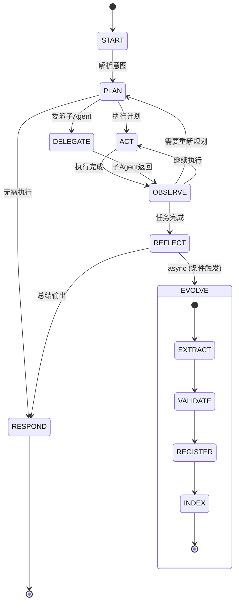
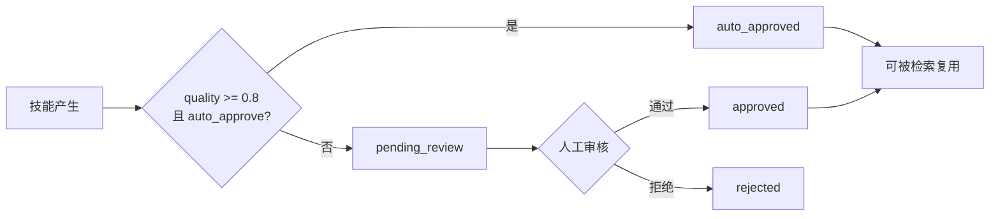

# 进化系统设计 (Evolution System)

## 1. 概述

进化系统是 Semibot 平台的自学习机制，让 Agent 在完成任务后自动提炼成功经验为可复用技能。

**Phase 1: 技能自生成** — Agent 在成功完成多步骤任务后，异步分析执行过程，提取可复用的技能模式并注册到技能库。

**灵感来源**: Voyager (Minecraft AI) 的 Skill Library 机制 — 通过不断积累可复用的技能代码片段，实现能力的持续增长。

**核心理念**: "让技能长出来，让 Agent 学会挑技能"

- **技能长出来**: 不是人工预定义所有技能，而是让 Agent 在实际任务中自然产生新技能
- **学会挑技能**: Agent 在规划阶段能智能检索和复用已进化的技能，避免重复劳动

---

## 2. 进化在 Runtime 中的位置

### 2.1 关键设计决策: REFLECT 之后异步执行

```text
START → PLAN → ACT/DELEGATE → OBSERVE → REFLECT → RESPOND → END
                                            │
                                            └──(async)──→ EVOLVE
```

EVOLVE 作为 REFLECT 之后的异步副作用执行，不阻塞主流程：

1. **不阻塞用户响应** — RESPOND 正常返回，EVOLVE 在后台异步执行
2. **基于反思总结** — REFLECT 已经产生了结构化的反思总结，EVOLVE 基于这个总结来提炼技能，信息质量更高
3. **进化是"副作用"** — 不应影响主流程的延迟和可靠性，即使 EVOLVE 失败也不影响用户体验
4. **资源隔离** — 进化过程涉及额外的 LLM 调用和向量计算，异步执行避免占用主流程资源

### 2.2 触发条件

并非每次任务都应触发进化，需满足以下全部条件：

| 条件 | 说明 | 阈值 |
|------|------|------|
| 任务成功 | REFLECT 判定任务成功完成 | `reflection.success = true` |
| 多步骤任务 | 涉及多步骤工具调用 | `step_count >= 3` |
| 复用价值 | LLM 评估任务模式的复用价值 | `reusability_score >= 0.7` |
| 未被覆盖 | 同类任务未被已有技能覆盖 | `embedding 相似度 < 0.85` |
| 冷却机制 | 同一 Agent 进化频率限制 | `每小时最多 5 次` |
| 进化开关 | Agent 配置中启用了进化 | `evolution.enabled = true` |

### 2.3 完整状态图



---

## 3. 进化流程详解

### 3.1 EVOLVE 子流程

```text
EXTRACT (提取) → VALIDATE (验证) → REGISTER (注册) → INDEX (索引)
```

每个阶段独立记录日志（evolution_logs），任一阶段失败则终止流程并记录错误。

#### 3.1.1 EXTRACT — 技能提取

**输入**: REFLECT 的反思总结 + execution_logs + tool_results

LLM 分析执行过程，提取结构化技能定义：

| 字段 | 类型 | 说明 |
|------|------|------|
| `skill_name` | string | 技能名称（简洁、动词开头） |
| `description` | string | 技能描述（一句话说明用途） |
| `trigger_keywords` | string[] | 触发关键词 |
| `steps` | object[] | 执行步骤序列 |
| `tools_used` | string[] | 使用的工具列表 |
| `parameters` | object | 可参数化的变量 |
| `preconditions` | object | 前置条件 |
| `expected_outcome` | string | 预期结果 |

**输出**: `SkillDraft`（技能草稿）

#### 3.1.2 VALIDATE — 技能验证

验证流程按顺序执行：

1. **完整性检查** — 技能草稿必须包含所有必填字段
2. **去重检查** — embedding 搜索已有技能库，相似度 > 0.85 则合并或跳过
3. **安全检查** — 确保技能步骤不包含危险操作（删除数据、系统命令等）
4. **质量评分** — LLM 评估技能的通用性和可复用性（0-1 分）
5. **准入门槛** — 只有 `quality_score >= 0.6` 的技能才进入下一步

#### 3.1.3 REGISTER — 技能注册

将验证通过的技能写入 `evolved_skills` 表：

- `source_type` 标记为 `'evolved'`
- 状态判定逻辑：
  - `quality_score >= 0.8` 且 `evolution_config.auto_approve = true` → `auto_approved`
  - 其他情况 → `pending_review`（需人工审核）

#### 3.1.4 INDEX — 技能索引

1. 生成技能描述的 embedding 向量（使用与长期记忆相同的 embedding 模型）
2. 存入 pgvector 用于后续相似度检索
3. 更新 SkillRegistry 缓存，使新技能立即可被检索

### 3.2 技能复用流程

当新任务进入时，PLAN 阶段集成进化技能检索：

```text
用户输入 → embedding 编码 → 检索 top-5 相关进化技能 → LLM 判断是否复用 → 生成计划
```

1. **PLAN 阶段** — 除了常规规划，还会检索进化技能库
2. **embedding 搜索** — 查询 top-5 相关且已审核通过的技能
3. **LLM 判断** — 评估是否可以复用某个进化技能
4. **执行复用** — 如果匹配，直接按技能定义的步骤执行
5. **反馈更新** — 复用后更新使用计数和成功率

---

## 4. 数据模型

### 4.1 evolved_skills 表（进化技能）

```sql
CREATE TABLE evolved_skills (
    id UUID PRIMARY KEY DEFAULT gen_random_uuid(),
    org_id UUID NOT NULL,                    -- 所属组织
    agent_id UUID NOT NULL,                  -- 产生此技能的 Agent
    session_id UUID NOT NULL,                -- 产生此技能的会话
    
    -- 技能定义
    name VARCHAR(200) NOT NULL,              -- 技能名称
    description TEXT NOT NULL,               -- 技能描述
    trigger_keywords TEXT[] DEFAULT '{}',    -- 触发关键词
    steps JSONB NOT NULL,                    -- 执行步骤序列
    tools_used TEXT[] DEFAULT '{}',          -- 使用的工具列表
    parameters JSONB DEFAULT '{}',           -- 可参数化的变量
    preconditions JSONB DEFAULT '{}',        -- 前置条件
    expected_outcome TEXT,                   -- 预期结果
    
    -- 向量索引
    embedding VECTOR(1536),                  -- 技能描述的向量表示
    
    -- 质量与状态
    quality_score FLOAT DEFAULT 0,           -- 质量评分 (0-1)
    reusability_score FLOAT DEFAULT 0,       -- 复用价值评分 (0-1)
    status VARCHAR(20) DEFAULT 'pending_review'
        CHECK (status IN ('pending_review', 'approved', 'rejected', 'auto_approved', 'deprecated')),
    
    -- 使用统计
    use_count INTEGER DEFAULT 0,             -- 被复用次数
    success_count INTEGER DEFAULT 0,         -- 复用成功次数
    last_used_at TIMESTAMPTZ,                -- 最后使用时间
    
    -- 审核
    reviewed_by UUID,                        -- 审核人
    reviewed_at TIMESTAMPTZ,                 -- 审核时间
    review_comment TEXT,                     -- 审核意见
    
    -- 时间戳
    created_at TIMESTAMPTZ DEFAULT NOW(),
    updated_at TIMESTAMPTZ DEFAULT NOW()
);

-- 索引
CREATE INDEX idx_evolved_skills_org ON evolved_skills(org_id);
CREATE INDEX idx_evolved_skills_agent ON evolved_skills(agent_id);
CREATE INDEX idx_evolved_skills_status ON evolved_skills(status);
CREATE INDEX idx_evolved_skills_quality ON evolved_skills(quality_score DESC);
CREATE INDEX idx_evolved_skills_embedding ON evolved_skills
    USING ivfflat (embedding vector_cosine_ops) WITH (lists = 100);
CREATE INDEX idx_evolved_skills_use_count ON evolved_skills(use_count DESC);
```

### 4.2 evolution_logs 表（进化日志）

```sql
CREATE TABLE evolution_logs (
    id UUID PRIMARY KEY DEFAULT gen_random_uuid(),
    org_id UUID NOT NULL,
    agent_id UUID NOT NULL,
    session_id UUID NOT NULL,
    
    -- 进化过程
    stage VARCHAR(20) NOT NULL               -- EXTRACT/VALIDATE/REGISTER/INDEX
        CHECK (stage IN ('extract', 'validate', 'register', 'index')),
    status VARCHAR(20) NOT NULL              -- 阶段状态
        CHECK (status IN ('started', 'completed', 'failed', 'skipped')),
    
    -- 结果
    evolved_skill_id UUID,                   -- 产生的技能ID（如有）
    input_data JSONB,                        -- 输入数据
    output_data JSONB,                       -- 输出数据
    error_message TEXT,                      -- 错误信息
    
    -- 指标
    duration_ms INTEGER,                     -- 耗时（毫秒）
    tokens_used INTEGER DEFAULT 0,           -- Token 消耗
    
    created_at TIMESTAMPTZ DEFAULT NOW()
);

-- 索引
CREATE INDEX idx_evolution_logs_org ON evolution_logs(org_id);
CREATE INDEX idx_evolution_logs_agent ON evolution_logs(agent_id);
CREATE INDEX idx_evolution_logs_session ON evolution_logs(session_id);
CREATE INDEX idx_evolution_logs_stage ON evolution_logs(stage);
```

### 4.3 agents 表扩展

在 `agents.config` JSONB 字段中新增 `evolution` 配置：

```json
{
    "evolution": {
        "enabled": true,
        "auto_approve": false,
        "min_quality_score": 0.6,
        "max_evolve_per_hour": 5,
        "cooldown_minutes": 10
    }
}
```

| 字段 | 类型 | 默认值 | 说明 |
|------|------|--------|------|
| `enabled` | boolean | `false` | 是否启用进化 |
| `auto_approve` | boolean | `false` | 高质量技能是否自动通过 |
| `min_quality_score` | float | `0.6` | 最低质量分数门槛 |
| `max_evolve_per_hour` | integer | `5` | 每小时最大进化次数 |
| `cooldown_minutes` | integer | `10` | 两次进化之间的冷却时间（分钟） |

---

## 5. Runtime 实现

### 5.1 EVOLVE 节点实现 (Python)

```python
import asyncio
from dataclasses import dataclass

@dataclass
class SkillDraft:
    """进化技能草稿"""
    name: str
    description: str
    trigger_keywords: list[str]
    steps: list[dict]
    tools_used: list[str]
    parameters: dict
    preconditions: dict
    expected_outcome: str
    quality_score: float = 0.0
    reusability_score: float = 0.0


class EvolutionEngine:
    """进化引擎 — REFLECT 之后异步执行"""
    
    def __init__(self, llm, memory_system, skill_registry, db_pool):
        self.llm = llm
        self.memory = memory_system
        self.skill_registry = skill_registry
        self.db = db_pool
    
    async def maybe_evolve(self, state: AgentState) -> None:
        """条件判断 + 异步触发进化"""
        if not self._should_evolve(state):
            return
        
        # Fire-and-forget: 不阻塞主流程
        asyncio.create_task(self._evolve(state))
    
    def _should_evolve(self, state: AgentState) -> bool:
        """判断是否触发进化"""
        reflection = state.get("reflection", {})
        
        # 1. 任务必须成功
        if not reflection.get("success", False):
            return False
        
        # 2. 多步骤任务（step_count >= 3）
        if len(state.get("tool_results", [])) < 3:
            return False
        
        # 3. 进化开关
        evolution_config = state.get("agent_config", {}).get("evolution", {})
        if not evolution_config.get("enabled", False):
            return False
        
        # 4. 冷却检查
        if not self._check_cooldown(state["agent_id"], evolution_config):
            return False
        
        return True
    
    async def _evolve(self, state: AgentState) -> None:
        """完整进化流程: EXTRACT → VALIDATE → REGISTER → INDEX"""
        try:
            # EXTRACT — 从执行过程中提取技能
            draft = await self._extract(state)
            if not draft:
                return
            
            # VALIDATE — 验证技能草稿
            validated = await self._validate(draft, state)
            if not validated:
                return
            
            # REGISTER — 注册技能到数据库
            skill_id = await self._register(draft, state)
            
            # INDEX — 生成向量索引
            await self._index(skill_id, draft)
            
        except Exception as e:
            await self._log_evolution_error(state, str(e))
    
    async def _extract(self, state: AgentState) -> SkillDraft | None:
        """EXTRACT — 从执行过程中提取技能"""
        prompt = EXTRACT_PROMPT.format(
            reflection=state["reflection"],
            plan=state["plan"],
            tool_results=state["tool_results"],
            messages=state["messages"][-10:]  # 最近 10 条消息
        )
        
        result = await self.llm.chat([
            {"role": "system", "content": "你是一个技能提取专家..."},
            {"role": "user", "content": prompt}
        ])
        
        return self._parse_skill_draft(result)
    
    async def _validate(self, draft: SkillDraft, state: AgentState) -> bool:
        """VALIDATE — 验证技能草稿"""
        # 去重检查: embedding 相似度 > 0.85 则跳过
        similar = await self.memory.search_evolved_skills(
            draft.description, threshold=0.85
        )
        if similar:
            logger.info(
                f"[Evolution] 技能已存在相似项，跳过 "
                f"(name={draft.name}, similar={similar[0]['name']})"
            )
            return False
        
        # 质量评估
        quality = await self._assess_quality(draft)
        draft.quality_score = quality["score"]
        draft.reusability_score = quality["reusability"]
        
        return draft.quality_score >= 0.6
    
    async def _register(self, draft: SkillDraft, state: AgentState) -> str:
        """REGISTER — 注册技能到数据库"""
        evolution_config = state["agent_config"].get("evolution", {})
        
        # 状态判定: 高质量 + 开启自动审核 → auto_approved
        status = "auto_approved" if (
            draft.quality_score >= 0.8 and 
            evolution_config.get("auto_approve", False)
        ) else "pending_review"
        
        # 写入 evolved_skills 表
        skill_id = await self.db.execute(...)
        return skill_id
    
    async def _index(self, skill_id: str, draft: SkillDraft) -> None:
        """INDEX — 生成向量索引"""
        embedding = await self.llm.embed(draft.description)
        await self.db.execute(
            "UPDATE evolved_skills SET embedding = $1 WHERE id = $2",
            embedding, skill_id
        )
        
        # 更新 SkillRegistry 缓存
        await self.skill_registry.refresh_cache()
```

### 5.2 EXTRACT Prompt Template

```text
EXTRACT_PROMPT = """
基于以下 Agent 执行记录，提取一个可复用的技能定义。

## 执行反思
{reflection}

## 执行计划
{plan}

## 工具调用结果
{tool_results}

## 对话上下文
{messages}

请以 JSON 格式输出技能定义：
{{
    "name": "技能名称（简洁、动词开头）",
    "description": "技能描述（一句话说明用途）",
    "trigger_keywords": ["触发关键词1", "关键词2"],
    "steps": [
        {{"order": 1, "action": "动作描述", "tool": "工具名", "params_template": {{}}}}
    ],
    "tools_used": ["tool1", "tool2"],
    "parameters": {{
        "param_name": {{"type": "string", "description": "参数说明", "required": true}}
    }},
    "preconditions": {{
        "required_tools": ["tool1"],
        "description": "前置条件说明"
    }},
    "expected_outcome": "预期结果描述",
    "reusability_score": 0.8
}}

注意：
1. 只提取具有通用复用价值的技能，不要提取一次性的特定任务
2. 参数化所有可变部分，使技能可以适用于不同输入
3. 步骤描述要足够清晰，让其他 Agent 也能执行
"""
```

### 5.3 技能复用 — PLAN 阶段集成

```python
async def plan_node_with_evolution(state: AgentState) -> AgentState:
    """增强的 PLAN 节点 — 集成进化技能检索"""
    
    # 1. 检索相关进化技能
    user_intent = state["messages"][-1]["content"]
    relevant_skills = await search_evolved_skills(
        query=user_intent,
        agent_id=state["agent_id"],
        limit=5,
        min_status="approved"  # 只检索已审核通过的
    )
    
    # 2. 将进化技能作为上下文注入 LLM
    skill_context = format_skills_for_prompt(relevant_skills)
    
    # 3. LLM 生成计划（可能复用已有技能）
    plan = await llm.generate_plan(
        messages=state["messages"],
        memory=state["memory_context"],
        available_evolved_skills=skill_context
    )
    
    # 4. 如果计划引用了进化技能，更新使用计数
    for skill_ref in plan.get("evolved_skill_refs", []):
        await increment_skill_use_count(skill_ref["id"])
    
    return {**state, "plan": plan}
```

---

## 6. API 设计

### 6.1 进化技能管理

#### 列出进化技能

```http
GET /api/v1/evolved-skills?status=pending_review&agent_id=xxx&limit=20
```

**Query 参数**:

| 参数 | 类型 | 说明 |
|------|------|------|
| `status` | string | 按状态过滤 |
| `agent_id` | UUID | 按 Agent 过滤 |
| `limit` | integer | 分页大小（默认 20） |
| `cursor` | string | 分页游标 |

#### 获取进化技能详情

```http
GET /api/v1/evolved-skills/:id
```

#### 审核进化技能

```http
POST /api/v1/evolved-skills/:id/review
```

```json
{
    "action": "approve",
    "comment": "审核意见"
}
```

| 字段 | 类型 | 必填 | 说明 |
|------|------|------|------|
| `action` | string | 是 | `approve` 或 `reject` |
| `comment` | string | 否 | 审核意见 |

#### 删除/废弃进化技能

```http
DELETE /api/v1/evolved-skills/:id
```

软删除，将 status 设为 `deprecated`。

#### 将进化技能提升为正式技能

```http
POST /api/v1/evolved-skills/:id/promote
```

将 `evolved_skill` 转换为 `skills` 表中的正式技能，`source_type` 标记为 `'evolved'`。

#### 获取进化统计

```http
GET /api/v1/agents/:agent_id/evolution/stats
```

**响应示例**:

```json
{
    "success": true,
    "data": {
        "total_evolved": 42,
        "approved_count": 28,
        "rejected_count": 5,
        "pending_count": 9,
        "approval_rate": 0.85,
        "total_reuse_count": 156,
        "avg_quality_score": 0.73,
        "top_skills": [
            {"id": "...", "name": "查询订单状态", "use_count": 34, "success_rate": 0.91}
        ]
    }
}
```

### 6.2 进化配置

#### 更新 Agent 进化配置

```http
PUT /api/v1/agents/:id/evolution
```

```json
{
    "enabled": true,
    "auto_approve": false,
    "min_quality_score": 0.6,
    "max_evolve_per_hour": 5,
    "cooldown_minutes": 10
}
```

---

## 7. 安全与治理

### 7.1 人工审核机制

- 默认所有进化技能需要人工审核（`pending_review`）
- 高质量（`quality_score >= 0.8`）+ 开启 `auto_approve` 的可自动通过
- 审核界面展示：技能定义、来源会话、质量评分、相似技能对比



### 7.2 安全检查

- **危险操作白名单** — 技能步骤中涉及删除数据、发送邮件、外部 API 调用等操作需要在白名单内
- **参数注入防护** — 技能参数不能注入系统命令，所有参数必须经过 Zod Schema 验证
- **进化频率限制** — 防止恶意触发大量进化消耗资源
- **租户隔离** — 进化技能严格按 `org_id` 隔离，不可跨租户访问

### 7.3 质量退化处理

自动监控技能复用效果，退化时自动处理：

| 条件 | 动作 |
|------|------|
| `success_rate < 50%` 且 `use_count >= 5` | 自动标记为 `deprecated` |
| `use_count = 0` 且创建超过 30 天 | 标记为候选清理 |
| 连续 3 次复用失败 | 临时禁用，等待人工审核 |

---

## 8. 监控指标

| 指标 | 类型 | 说明 |
|------|------|------|
| `evolution_triggered_total` | Counter | 进化触发总次数 |
| `evolution_success_total` | Counter | 进化成功次数 |
| `evolution_skill_quality` | Histogram | 技能质量分布 |
| `evolved_skill_reuse_total` | Counter | 进化技能被复用次数 |
| `evolved_skill_reuse_success_rate` | Gauge | 复用成功率 |
| `evolution_duration_seconds` | Histogram | 进化流程耗时 |
| `evolution_tokens_total` | Counter | 进化消耗的 Token |

---

## 9. Webhook 事件

| 事件 | 说明 |
|------|------|
| `evolution.triggered` | 进化流程触发 |
| `evolution.skill_created` | 新技能产生 |
| `evolution.skill_approved` | 技能审核通过 |
| `evolution.skill_rejected` | 技能审核拒绝 |
| `evolution.skill_deprecated` | 技能被废弃 |
| `evolution.skill_promoted` | 技能提升为正式技能 |

---

## 10. 未来演进 (Phase 2 预留)

- **Agent 自适应** — 基于进化技能的使用反馈，优化 Agent 的任务分解策略
- **跨 Agent 技能共享** — 一个 Agent 进化出的技能可以被同组织其他 Agent 使用
- **技能组合** — 多个原子进化技能自动组合为复合技能
- **技能市场** — 优质进化技能可发布到公共市场供其他组织使用
